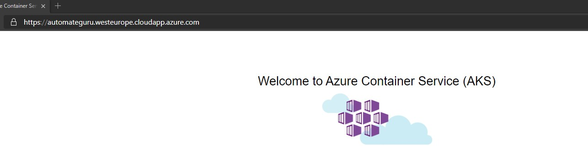
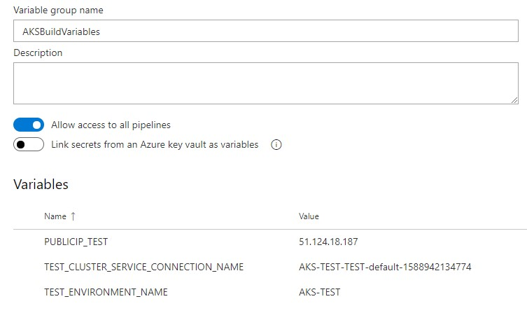
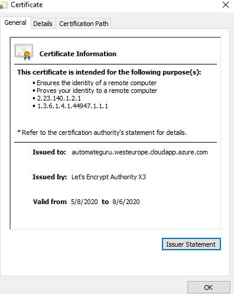

# Automatic certificate generation for Azure Kubernetes Service



For all administrators which are taking care of web application support, certificates management is very annoying task.
If you have reminder for that it's not a problem, however in many cases admins simply forgot to update it on time.
In this post I will try to show you how to automate **certificate generation** and assignmnet process for **Azure Kubernetes Service** using **certmanager**, **Let's Encrypt** and [**Azure DevOps YAML pipelines**](https://automate.guru/multi-stage-yaml-pipeline-configuration/) about which I wrote in my previous article. If you didn't read it yet, strongly recommend to do that.

## Why certificate on Azure Kubernetes Service?

Nowadays Kubernetes become more and more popular solution for web application. Companire are still a little bit afraid about using Platform as a Service solution in Cloud and preffer to use containers instead of it. For IT specialist containarization can be in some cases a little bit complicated, especially if they were not familiar in the past with Linux. 

To have secured connection between client and application stored on Azure Kubernetes Service or other container orchestrator, application must have in the front SSL certificate assigned in same way as web application stored on any other standard service. In AKS we will use [Nginx Ingress](https://kubernetes.github.io/ingress-nginx/) for that

### How the process for certificate automation should looks like?

Our main deployment pipeline will process in following way:
1. [Helm](https://helm.sh/docs/intro/) tool installation
2. Configuration of custom namespace in AKS (In our case it will be ingress-basic)
3. Adding Nginx to repository
4. Installation of Nginx Ingress
5. Installation of custom resource of cert manager in version 0.13
6. Adding jetstack (certmanager) package to repository
7. Certmanager installation
8. Cluster issuer configuration on AKS
9. Applying Demo "Hello world" application
10. Certificate creation and assignment to Nginx Ingress

But before main configuration let's check requirements which should be configured first.

### Prerequisites

1. First off all you must have AKS cluster ready.
2. Service connection and environment should be configured to access DevOps (described how it should be done in **Multi-stage YAML pipeline** post).
3. Create public IP using below Azure CLI command - it should be created in same resource group as AKS cluster nodes. 
```CLI
az network public-ip create --resource-group MC_myResourceGroup_myAKSCluster_eastus --name myAKSPublicIP --sku Standard --allocation-method static --query publicIp.ipAddress -o tsv
```
Once public IP is created you can add DNS name for it directly in Azure portal.
[Public IP](img/aks-cert-manager-006.jpg)
4. Configure Variable group in Azure DevOps library with variables like on below picture (in my example it's only done for TEST environment but you can expand it as you want). Values for those variables should be taken from point **2** and **3**.

5. Configure access for Azure DevOps service connection to AKS by providing specific permission - in our case it will be cluster admin but you can limit it. Create **role.yaml** file as below and later deploy it using **Az CLI** and **kubectl** commands.
```yaml
apiVersion: rbac.authorization.k8s.io/v1
kind: ClusterRoleBinding
metadata:
  name: cluster-admins
roleRef:
  apiGroup: rbac.authorization.k8s.io
  kind: ClusterRole
  name: cluster-admin
subjects:
- kind: Group
  name: system:serviceaccounts
  apiGroup: rbac.authorization.k8s.io
```
```CLI
az login
az account set --subscription "SUBSCRIPTION-NAME"
az aks get-credentials --name aks-cluster --resource-group aks-resource-group
kubectl -f role.yaml
```

## Now is time for real meat!

Once all prerequistes are configured we can start configuration of code.

### Cluster issuer configuration.

Our first yaml file will contain defintion of cluster issuer. 
In our case we will use **Let's encrypt** server for signing certificate.
All supprted certificate issuers can be found on [certmanager webpage](https://cert-manager.io/docs/configuration/).

Create file called **certificate-cluster-issuer.yaml** paste content provided below and adjust your mail address.

```yaml
apiVersion: cert-manager.io/v1alpha2
kind: ClusterIssuer
metadata:
  name: letsencrypt
spec:
  acme:
    server: https://acme-v02.api.letsencrypt.org/directory
    email: your@mail.com
    privateKeySecretRef:
      name: letsencrypt
    solvers:
    - http01:
        ingress:
          class: nginx
```

### Deploy hello world application to your AKS cluster

To deploy appliaction we will use demo application from public image, but if you want you can create custom one.
Copy content below and paste it to file **aks-helloworld.yaml**.

```yaml
apiVersion: apps/v1
kind: Deployment
metadata:
  name: aks-helloworld
spec:
  replicas: 1
  selector:
    matchLabels:
      app: aks-helloworld
  template:
    metadata:
      labels:
        app: aks-helloworld
    spec:
      containers:
      - name: aks-helloworld
        image: neilpeterson/aks-helloworld:v1
        ports:
        - containerPort: 80
        env:
        - name: AUTOMATEGURU
          value: "Welcome to AUTOMATE.GURU Azure Kubernetes Service (AKS)"
---
apiVersion: v1
kind: Service
metadata:
  name: aks-helloworld
spec:
  type: ClusterIP
  ports:
  - port: 80
  selector:
    app: aks-helloworld
```

### Configure Ingress for custom domain and certificate

Ingress controller needs a defintion of DNS and certificate to know exactly from which adress it should be available.
As you see below our domain has been set to **automateguru.westeurope.cloudapp.azure.com** and it has been assigned to public IP created as a prerequiste.
Certificate (secret name) is taken from **tls-secret** which will created in next step.
As a backend we defined **aks-helloworld** service to point to our demo application.
Below yaml should be created as **ingress-assign-certificate-test.yaml** file.

```yaml
apiVersion: extensions/v1beta1
kind: Ingress
metadata:
  name: hello-world-ingress
  annotations:
    kubernetes.io/ingress.class: nginx
    cert-manager.io/cluster-issuer: letsencrypt
    nginx.ingress.kubernetes.io/rewrite-target: /$1
spec:
  tls:
  - hosts:
    - automateguru.westeurope.cloudapp.azure.com
    secretName: tls-secret
  rules:
  - host: automateguru.westeurope.cloudapp.azure.com
    http:
      paths:
      - backend:
          serviceName: aks-helloworld
          servicePort: 80
        path: /(.*)
```

### Certificate configuration

Now we need to define configuration for our certificate.
In **spec** section we should provide name of the secret in which certificate will be stored - it's configured in **ingress-assign-certificate-test.yaml**  so keep it in mind that if you want to change the name it should be changed there as well.
As a dnsNames we should provide public DNS name of our application.
In issuerRef we are providing name of the **cluster issuer** which was defined in file **certificate-cluster-issuer.yaml**.
Once yaml is adjusted we are saving it as **certificate-test.yaml** file.

```yaml
apiVersion: cert-manager.io/v1alpha2
kind: Certificate
metadata:
  name: tls-secret
  namespace: ingress-basic
spec:
  secretName: tls-secret
  dnsNames:
  - automateguru.westeurope.cloudapp.azure.com
  acme:
    config:
    - http01:
        ingressClass: nginx
      domains:
      - automateguru.westeurope.cloudapp.azure.com
  issuerRef:
    name: letsencrypt
    kind: ClusterIssuer
```

### And the magic is in the pipeline definition

Once you created all yaml defintion you should create proper pipeline definition to automate whole process.

Keep in mind that we are doing deployment only in test environment, so if you want to automate it for more stages you must adjust it.

Configure **deploy-to-all-stages.yaml** file. Values of the variables are taken from Azure DevOps variable groups.

```yaml
stages:
- template: deployment-stage.yaml
  parameters:
    STAGE_NAME: TEST
    STAGE_ENVIRONMENT: $(TEST_ENVIRONMENT_NAME)
    STAGE_K8S_SERVICE_ENDPOINT: $(TEST_CLUSTER_SERVICE_CONNECTION_NAME)
    STAGE_PUBLIC_IP: $(PUBLICIP_TEST)
```

Main pipeline defintion should be stored in **deployment-stage.yaml** file.
Whole process has been described in chapter **How the process for certificate automation should looks like?**

```yaml
parameters:
  STAGE_NAME: ''
  STAGE_ENVIRONMENT: ''
  STAGE_K8S_SERVICE_ENDPOINT: ''
  STAGE_PUBLIC_IP: ''

stages:
- stage: ${{ parameters.STAGE_NAME }}
  jobs:  
  - deployment: SetupCluster
    pool: 
      vmImage: 'ubuntu-latest'
    environment: ${{ parameters.STAGE_ENVIRONMENT }}
    strategy: 
      runOnce:
        deploy:
          steps:
          - task: DownloadPipelineArtifact@2
            inputs:
              artifactName: yaml
              targetPath: $(Build.SourcesDirectory)/yaml

          - task: HelmInstaller@1
            inputs:
              helmVersionToInstall: '3.2.0'
        
          - task: Kubernetes@1
            displayName: Configure ingress namespace
            inputs:
              connectionType: 'Kubernetes Service Connection'
              kubernetesServiceEndpoint: ${{ parameters.STAGE_K8S_SERVICE_ENDPOINT }}
              command: 'create'
              arguments: 'namespace ingress-basic'
         
          - task: Bash@3
            displayName: "Repo add nginx"
            inputs:
              targetType: 'inline'
              script: 'helm repo add stable https://kubernetes-charts.storage.googleapis.com/'
        
          - task: HelmDeploy@0
            displayName: Install Nginx
            inputs:
              connectionType: 'Kubernetes Service Connection'
              kubernetesServiceEndpoint: ${{ parameters.STAGE_K8S_SERVICE_ENDPOINT }}
              namespace: 'ingress-basic'
              command: 'install'
              chartType: 'Name'
              chartName: 'stable/nginx-ingress'
              arguments: '--set controller.replicaCount=1 --set controller.service.loadBalancerIP=${{ parameters.STAGE_PUBLIC_IP }} --set controller.nodeSelector."beta\.kubernetes\.io/os"=linux --set defaultBackend.nodeSelector."beta\.kubernetes\.io/os"=linux'
          
          - task: Kubernetes@1
            displayName: Create custom resources
            inputs:
              connectionType: 'Kubernetes Service Connection'
              kubernetesServiceEndpoint: ${{ parameters.STAGE_K8S_SERVICE_ENDPOINT }}
              command: 'apply'
              arguments: '--validate=false -f https://raw.githubusercontent.com/jetstack/cert-manager/release-0.13/deploy/manifests/00-crds.yaml'

          - task: Bash@3
            displayName: "Repo add jetstack"
            inputs:
              targetType: 'inline'
              script: 'helm repo add jetstack https://charts.jetstack.io'

          - task: Bash@3
            displayName: "Repo update"
            inputs:
              targetType: 'inline'
              script: 'helm repo update'

          - task: HelmDeploy@0
            displayName: Install cert-manager
            inputs:
              connectionType: 'Kubernetes Service Connection'
              kubernetesServiceEndpoint: ${{ parameters.STAGE_K8S_SERVICE_ENDPOINT }}
              namespace: 'ingress-basic'
              command: 'install'
              chartType: 'Name'
              chartName: 'jetstack/cert-manager'
              arguments: '--version v0.13.0'
          
          - task: Kubernetes@1
            displayName: Apply cluster issuer
            inputs:
              connectionType: 'Kubernetes Service Connection'
              kubernetesServiceEndpoint: ${{ parameters.STAGE_K8S_SERVICE_ENDPOINT }}
              command: 'apply'
              arguments: '-f $(Build.SourcesDirectory)/yaml/certificate-cluster-issuer.yaml'

          - task: Kubernetes@1
            displayName: Apply Hello World
            inputs:
              connectionType: 'Kubernetes Service Connection'
              kubernetesServiceEndpoint: ${{ parameters.STAGE_K8S_SERVICE_ENDPOINT }}
              namespace: 'ingress-basic'
              command: 'apply'
              arguments: '-f $(Build.SourcesDirectory)/yaml/aks-helloworld.yaml'
                    
          - task: Kubernetes@1
            displayName: Ingress assign certificate
            inputs:
              connectionType: 'Kubernetes Service Connection'
              kubernetesServiceEndpoint: ${{ parameters.STAGE_K8S_SERVICE_ENDPOINT }}
              namespace: 'ingress-basic'
              command: 'apply'
              arguments: '-f $(Build.SourcesDirectory)/yaml/ingress-assign-certificate-${{ parameters.STAGE_NAME }}.yaml'

          - task: Kubernetes@1
            displayName: Create certificate
            inputs:
              connectionType: 'Kubernetes Service Connection'
              kubernetesServiceEndpoint: ${{ parameters.STAGE_K8S_SERVICE_ENDPOINT }}
              namespace: 'ingress-basic'
              command: 'apply'
              arguments: '-f $(Build.SourcesDirectory)/yaml/certificate-${{ parameters.STAGE_NAME }}.yaml'
```

## We are ready for deployment!

If you configured everything correctly and already run your pipeline it's time to check if it's working.

Go to your web browser and navigate to your application address.


If you see screen similar like on above without any error probably it's working.

But to be 100% sure check certificate ;)



If something is not clear in this process, please leave a comment.
Hope that we will be able to help you!
