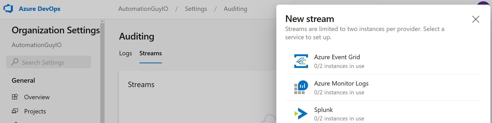
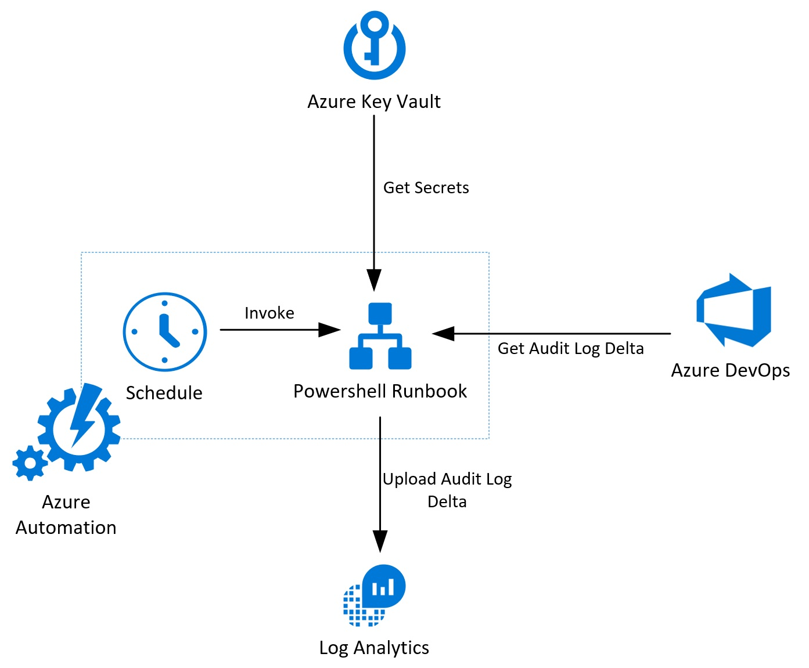
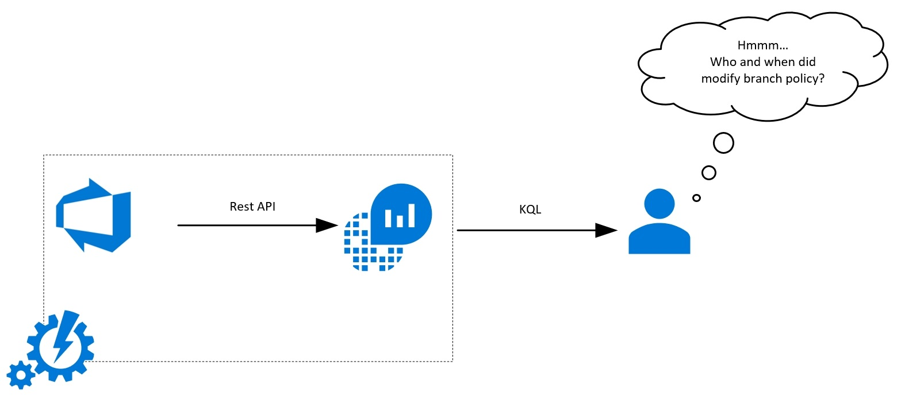
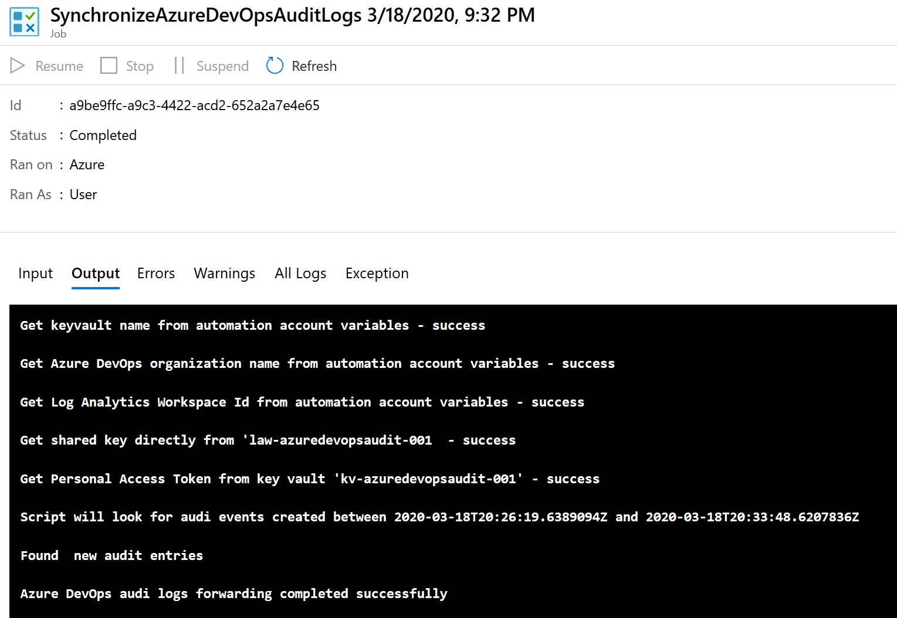
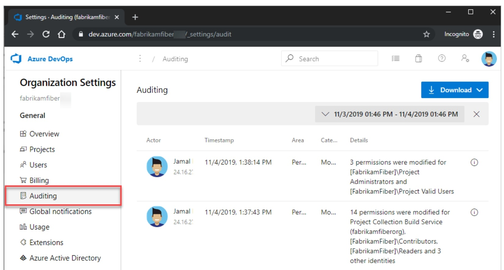

# Forward Azure DevOps Audit Logs to Log Analytics Workspace

!!! danger
    You will find more details [here](https://devblogs.microsoft.com/devops/auditing-for-azure-devops-is-now-in-public-preview/)
    Update! At the moment of writing, this functionality was not provided, but now it is in public preview. We always recommend using built-in, supported features. 
    

!!! info
    Why is this article not removed? 
    There is a part of the script you can use to query Audit Logs via API and stream custom logs to Log Analytics.

## Is Log Analytics Workspace clairvoyant?

No it isn't! Therefore, we developed an automated solution that is continuously streaming audit logs from Azure DevOps to Log Analytics Workspace.



## Let's start from demo.



1. Modify the branch policy and start to be suspicious.


2. Invoke synchronization manually or wait.


3. Check the results.


## What is available out of the box?

<!--  -->

- Browsing logs through web portal.
- Exporting them to JSON/ CSV
- Analyze them using Excel/ custom tools.

More general information about Azure DevOps Auditing is available in the link below. It's not our purpose to paraphrase MS documentation. 
Please read the following part of their documentation to get more details about ADO auditing in general.

[You can find more details here!](https://docs.microsoft.com/en-us/azure/devops/organizations/settings/azure-devops-auditing?view=azure-devops&tabs=preview-page)

## Acronyms and abbreviations 

- **ADO** - Azure DevOps
- **ORG** - Azure DevOps Organization
- **PAT** - Personal Access Token from ADO

- **AAA** - Azure Automation Account
- **ARA** - Azure Run As Account

- **AKV** - Azure Key Vault

- **LAW** - Azure Log Analytics Workspace


## Who are you?

We assume that...

```text
PS C:\> $You.SessionLevelReadiness -GE 200
True
```

... so we're not providing detailed, step by step instructions on how to create every single resource required to deploy this solution.
We believe that you can deploy and configure them without additional instructions, or you're able to find them on your own.

## Prepare infrastructure 

Here are required resources and it's the configuration required to deploy the described solution:

- Organization in Azure DevOps with enabled auditing.
- Personal Access Token with *read audit log events, manage and delete streams* scope.
- Azure Automation Account with *Azure Run As Account*. 
- AAA string variables named KeyVaultName, WorkspaceId, OrganizationName
- AAA string variable named LastAzureDevOpsSyncDate with round-trip date/time pattern value (for example *2020-01-01T00:00:00.0000001Z*)
- Azure Key Vault
- AKV *Get and list secret* access policy for ARA.
- *AzureDevOpsPersonalAccessToken* secret in AKV containing PAT value.
- Azure Log Analytics Workspace.
- *Shared key read* permissions for ARA.
- Azure Automation Powershell **SynchronizeAzureDevOpsAuditLogs** Runbook ([get it here](https://github.com/automationgurus/automationgurus.github.io/blob/master/src/code/SynchronizeAzureDevOpsAuditLogsRunbook.ps1))

## Solution overview. More details.

1. Every single hour Azure Automation Runbook (AAC) is invoked by schedule.
2. Set context. All actions are performed in the context of *Azure Run As Account*. This account was created during Automation Account creation.
3. Get parameters (read details above).
4. Get all ADO audit logs entries between *LastAzureDevOpsSyncDate* and current date and time.
5. Upload event to Log Analytics Workspace via REST API call.
6. Update *LastAzureDevOpsSyncDate*.


## Solution parameters

| Script Parameter   | Source/ Where you should set it |
|--------------------|-|
| $KeyVaultName      | KeyVaultName variable from Automation Account |
| $StartTime         | LastAzureDevOpsSyncDate variable from Automation Account | 
| $OrganizationName  | OrganizationName variable from Automation Account |
| $CustomerId        | WorkspaceId variable from Automation Account |
| $PersonAccessToken | AzureDevOpsPersonalAccessToken secret from  Azure KeyVault |
| $SharedKey         | SharedKey property from Log Analytics Workspace (Id = $CustomerId) |


## Powershell Runbook

[Get SynchronizeAzureDevOpsAuditLogsRunbook Source Code](https://github.com/automationgurus/automationgurus.github.io/blob/master/src/code/SynchronizeAzureDevOpsAuditLogsRunbook.ps1)

We use *Build-Signature* and *Post-LogAnalyticsData* from 
[MS DOCS: Data collector api](https://docs.microsoft.com/en-us/azure/azure-monitor/platform/data-collector-api)
. In this example, they use $TimeStampField variable that is global. It isn't good practice to use in function variables defined out of function scope. We replaced that.

```powershell
Function Build-Signature ($customerId, $sharedKey, $date, $contentLength, $method, $contentType, $resource)
{
    $xHeaders = "x-ms-date:" + $date
    $stringToHash = $method + "`n" + $contentLength + "`n" + $contentType + "`n" + $xHeaders + "`n" + $resource

    $bytesToHash = [Text.Encoding]::UTF8.GetBytes($stringToHash)
    $keyBytes = [Convert]::FromBase64String($sharedKey)

    $sha256 = New-Object System.Security.Cryptography.HMACSHA256
    $sha256.Key = $keyBytes
    $calculatedHash = $sha256.ComputeHash($bytesToHash)
    $encodedHash = [Convert]::ToBase64String($calculatedHash)
    $authorization = 'SharedKey {0}:{1}' -f $customerId,$encodedHash
    return $authorization
}

Function Post-LogAnalyticsData($ustomerId, $sharedKey, $body, $logType)
{
    $method = "POST"
    $contentType = "application/json"
    $resource = "/api/logs"
    $rfc1123date = [DateTime]::UtcNow.ToString("r")
    $contentLength = $body.Length
    $signature = Build-Signature `
        -customerId $customerId `
        -sharedKey $sharedKey `
        -date $rfc1123date `
        -contentLength $contentLength `
        -method $method `
        -contentType $contentType `
        -resource $resource
    $uri = "https://" + $customerId + ".ods.opinsights.azure.com" + $resource + "?api-version=2016-04-01"

    $headers = @{
        "Authorization" = $signature;
        "Log-Type" = $logType;
        "x-ms-date" = $rfc1123date;
        "time-generated-field" = "timestamp";
    }

    $response = Invoke-WebRequest -Uri $uri -Method $method -ContentType $contentType -Headers $headers -Body $body -UseBasicParsing
    return $response.StatusCode

}

$LogType = "AzureDevOps"

$Conn = Get-AutomationConnection -Name AzureRunAsConnection
Connect-AzAccount -ServicePrincipal -Tenant $Conn.TenantID -ApplicationId $Conn.ApplicationID -CertificateThumbprint $Conn.CertificateThumbprint | Out-Null
Select-AzSubscription -SubscriptionId $Conn.SubscriptionID | Out-Null

$KeyVaultName =  Get-AutomationVariable -Name KeyVaultName
Write-Output -InputObject 'Get keyvault name from automation account variables - success'

$OrganizationName = Get-AutomationVariable -Name OrganizationName
Write-Output -InputObject 'Get Azure DevOps organization name from automation account variables - success'

$CustomerId = Get-AutomationVariable -Name WorkspaceId
Write-Output -InputObject 'Get Log Analytics Workspace Id from automation account variables - success'

$LogAnalyticsWorkspace = Get-AzOperationalInsightsWorkspace | Where-Object -Property CustomerId -EQ $CustomerId
$SharedKey = (Get-AzOperationalInsightsWorkspaceSharedKey -ResourceGroupName $logAnalyticsWorkspace.ResourceGroupName -Name $logAnalyticsWorkspace.Name).PrimarySharedKey
Write-Output -InputObject "Get shared key directly from '$( $logAnalyticsWorkspace.Name )  - success"

$PersonAccessToken = (Get-AzKeyVaultSecret -VaultName $KeyVaultName  -Name 'AzureDevOpsPersonalAccessToken').SecretValueText 
Write-Output -InputObject "Get Personal Access Token from key vault '$( $KeyVaultName  )' - success"

$StartTime = Get-AutomationVariable -Name LastAzureDevOpsSyncDate
$StartTime = $StartTime.ToUniversalTime().GetDateTimeFormats("o")

[string]$EndTimeQuery = [DateTime]::Now.ToUniversalTime().GetDateTimeFormats("o")

Write-Output -InputObject "Script will look for audi events created between $( $StartTime ) and $( $endTimeQuery )"

$Base64AuthInfo = [Convert]::ToBase64String([Text.Encoding]::ASCII.GetBytes(("{0}:{1}" -f 'basic',$PersonAccessToken)))

$Headers = @{
    Authorization = "Basic $Base64AuthInfo"
}

[array]$ApiOutputs = @()
[string]$ContinuationToken = ''

do {
    $EndpointUri = "https://auditservice.dev.azure.com/$( $OrganizationName )/_apis/audit/auditlog?api-version=5.1-preview.1"
    $EndpointUri += "&batchSize=200"
    $EndpointUri += "&skipAggregation=true"
    $EndpointUri += "&startTime=$( $StartTime )"
    $EndpointUri += "&endTime=$( $endTimeQuery )"

    if ($ContinuationToken) {
        $EndpointUri += "&continuationToken=$( $continuationToken )"
    }

    $ApiOutput = Invoke-RestMethod -Uri $endpointUri -Headers $headers  -Method Get 
    $ContinuationToken = $ApiOutput.continuationToken #tu

    $ApiOutputs += $ApiOutput

} while ($ApiOutput.hasMore)

[array]$DecoratedAuditLogEntries = $ApiOutputs.decoratedAuditLogEntries 

if(-not $DecoratedAuditLogEntries) {
    Write-Output -InputObject 'There are no new audit logs.'
    return;
}

Write-Output -InputObject "Found $( $DecoratedAuditLogEntries.Count ) new audit entries"


foreach ($item in $DecoratedAuditLogEntries ) {
    $item.data = $item.data | ConvertTo-Json -Compress -Depth 100
}

$RecordsJson = $DecoratedAuditLogEntries | `
    Select-Object -ExcludeProperty actorImageUrl | `
    ConvertTo-Json 


$StatusCode = Post-LogAnalyticsData -customerId $CustomerId -sharedKey $SharedKey -body ([System.Text.Encoding]::UTF8.GetBytes($recordsJson)) -logType $LogType

if($StatusCode -eq 200){
    Set-AutomationVariable -Name LastAzureDevOpsSyncDate -Value $endTimeQuery
    Write-Output -InputObject 'Azure DevOps audi logs forwarding completed successfully'
}
```

<!-- You can find the script we use here

Some more description about actions inside the script

Get variables from Azure Automation:

```powershell
$OrganizationName = Get-AutomationVariable -Name OrganizationName
```

Get LAW SharedKey (it's required to invoke API calls)

```powershell
$SharedKey = Get-AzOperationalInsightsWorkspaceSharedKey -ResourceGroupName $logAnalyticsWorkspace.ResourceGroupName -Name $logAnalyticsWorkspace.Name
```

```powershell
$endpointUri = "https://auditservice.dev.azure.com/$( $OrganizationName )/" + 
        "_apis/audit/auditlog?api-version=5.1-preview.1" # + "&skipAggregation=$( $skipAggregation )"
$endpointUri += "&batchSize=200"
$endpointUri += "&skipAggregation=true"
$endpointUri += "&startTime=$( $StartTime )"
$endpointUri += "&endTime=$( $endTime )"

```


### -->


## It's time to rest and check what we did


1. You've just discovered new extension installed.


2. You wonder who and when did install this AzSK Extension, so you ask Log Analytics.
```
AzureDevOps_CL 
| sort by TimeGenerated desc nulls last 
| where actionId_s == "Extension.Installed" 
| project  TimeGenerated, actionId_s, scopeDisplayName_s , details_s, actorDisplayName_s 
```
|TimeGenerated| actionId_s|     scopeDisplayName_s|     details_s|      actorDisplayName_s|
|-|-|-|-|-|
|2020-03-15T16:47:19.367Z|      Extension.Installed|    AutomationGuyIO (Organization)| Extension "Secure DevOps Kit (AzSK) CICD Extensions for Azure" from publisher "Microsoft DevLabs" was installed - Version "3.1.7"|      Automation Guru

## Solution development insights

- ARA becomes a Contributor by default. Consider changing that.
- Storing LAW SharedKey in AKV is one of the options, but it'll force you to update it on change. We decided to get it directly during the script execution. 
- We could use AAA encrypted value to store PAT, but in case of storing secrets, AKV should always be the primary choice. Other parameters we don't consider as secrets, so we store them in AAA variables.
- Enabling *Allow trusted Microsoft services to bypass this firewall* in AKW Networking configuration didn't allow access from AAA. Therefore we set this setting to *Allow access from all networks*.

## Visit also

1. [Dominic Batstone's Blog: Export ADO Audit Logs and query them with LogParser ](https://dombat.co.uk/azure-devops-auditing/)

1. [mohitgoyal.co: Working with Audit logs in Azure DevOps](https://mohitgoyal.co/2019/07/24/working-with-audit-logs-in-azure-devops/)

## Author


**Kamil Więcek** is twentynine years old IT passionate that will continue to learn, do home projects and practicing new technologies even if he becomes a multimillionaire. 
Big fan of the following sentence: "if you describe a process mentioning someone's name, then it is not automated."
