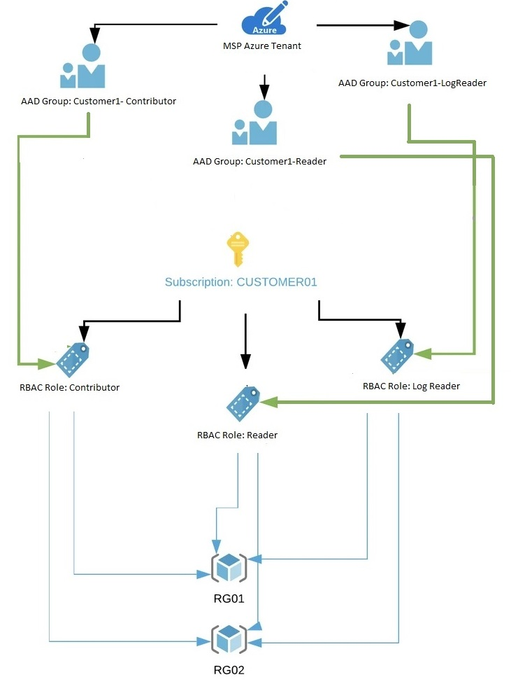

# Azure Lighthouse configuration



## Why should you read this article? What are the benefits?

1. You want to manage all your customer in one place.
2. You don't want to switch between subscriptions or between accounts.
3. You want to manage access to specific customer roles without asking each time customer to do that.
4. You are awesome managed service provider who is using best services in Azure in order to do that.

## High Level overview

### From Service provider team perspective


1. Service provider tenant user which is added to proper group get access to **My Cusotmers** tab in Azure Lighthouse
2. Can see all customers which are assigned to him.
3. Can check AAD Group Membership and related role at the customer destination subscription.
4. Can check access to customer resource

### From customer perspective


1. Customer get access to new tab in Azure Lighthouse **Service Providers**
2. Can see all service providers
3. Display exact delegations for each provider
4. Check offer details and correlated assigned role

## Prerequisites
1. Az PowerShell Module installed
2. Account with Owner role in customer tenant
3. Access to create and configure Azure Active Directory groups in Manged Service Provider tenant

## Service Provider ARM template

To deploy desired configuration in customer tenant below template must be used.

In such ARM template we basically do the mapping between groups created earlier in Azure AD of Managed Service Provider tenant and role IDs defined in customer tenant.

To check role defintion ID use Powershell command
```powershell
(Get-AzRoleDefinition -Name "Name_of_the_role").Id
```

To check Azure Active Directory group ID use Powershell command
```power
(Get-AzADGroup -Name "Name_of_the_AAD_group").ObjectId
```

If you don't have yet groups created you can simply create them with following script:
```powershell
param(
    $TenantID,
    $CustomerName
)

Connect-AzAccount -Tenant $TenantID

$groups = @(
    "Logs-Reader", 
    "Customer-Reader", 
    "Customer-Contributor"
)

foreach ($group in $groups) {
    $groupName = "Lighthouse-$CustomerName-$group"
    $aadGroup = Get-AzADGroup -DisplayName $groupName

    if ($aadGroup) {
        Write-Output "Group $groupName already exists."
    }
    else {
        Try {
            New-AzADGroup -DisplayName $groupName -MailNickname $groupName
            Start-Sleep -s 5
            $aadGroup = (Get-AzADGroup -DisplayName $groupName).ObjectId
            Write-Output "AAD Group $groupName with id $aadGroupId created with success"
        }
        Catch {
            Write-Output "Unexpected error occured during AAD group creation. Error: $($_.exception.Message)"
        }
        
    }
  
}
```

Here you can find short description of each parameter in ARM:

* **mspOfferName** - name of the offer from the Managed Service Provider
* **mspOfferDescription** - name of the Managed Service Provider offering
* **managedByTenantId** - Managed Service Provider tenant ID
* **authorizations** - in this part you should provide array according to how you want to configure access in Azure Lighthouse. 

```ARM
"parameters": {
    "mspOfferName": {
        "value": ""
    },
    "mspOfferDescription": {
        "value": ""
    },
    "managedByTenantId": {
        "value": ""	
    },
    "authorizations": {
        "value": [
            {
                "principalId": "000000-0000-00000-0000-0000000",
                "principalIdDisplayName": "Logs Reader",
                "roleDefinitionId": "73c42c96-874c-492b-b04d-ab87d138a893"
            },
            {
                "principalId": "000000-0000-00000-0000-0000000",
                "principalIdDisplayName": "Customer Reader",
                "roleDefinitionId": "acdd72a7-3385-48ef-bd42-f606fba81ae7"
            },
            {
                "principalId": "000000-0000-00000-0000-0000000",
                "principalIdDisplayName": "Customer Contributor",
                "roleDefinitionId": "b24988ac-6180-42a0-ab88-20f7382dd24c"
            }
        ]
    }
}
```

In order to deploy such ARM you can simply use **New-AzDeployment** from PowerShell Az module.

**IMPORTANT!**

Remember that you must be logged to customer tenant to deploy ARM template, not Managed Service Provider tenant.

## Things to have in mind before applying this solution
1. Decide how you want to manage access to your customers. Do you want to have same groups for all of them or separate one?
2. Decide which roles are necessary for you and split them correctly - you can always do it later however it's best to have solution ready from the beginning.