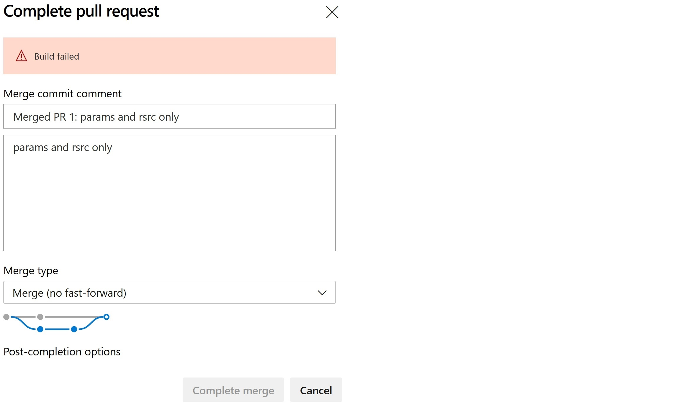
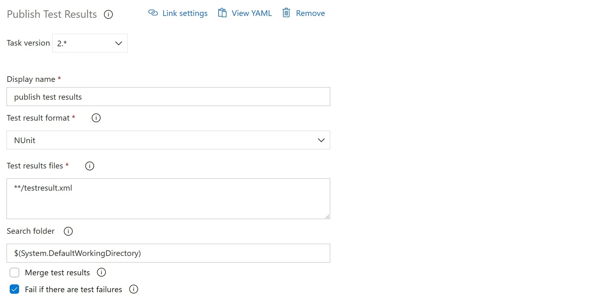

# Security and Compliance as a Code: Azure Policy Continous Inspection


In this blog entry, we will show you how to integrate **automated Azure Policy tests** with your **DevOps process**. 
Automated Azure Policy deployment, invoking automated Pester test, and publish **tests report** will be **part of** your **pull request** process. 
These steps will be performed in the **sandbox** so that it will be **safe** for the rest of your environment. 

After completing the steps described in this and last article, you will have everything ready to start writing Azure Policy without the need to perform many manual tests.

## The most important question always is why!

In [one of the previous articles](https://automate.guru/security-and-compliance-as-a-code-azure-policy-tdd/), we presented Pester as a tool used for test-driven development of Azure Policy. You might find it **overkill** to achieve **test-driven development** for **Azure Policy**. **We agree** that **usually**, it will not be required to write tests. You will also find out scenario details there.

<!-- Azure Policy Built-in capabilities for **string validation** are limited. If you want to guarantee **tag value** level **compliance**, you must use ARM functions in your policies.  -->

The current state of the art is that we have some **complex requirements** regarding tag values. We have to validate tag values (**emails**, **dates**, **multiple values separated by a slash**). It is not that easy to satisfy them without using **ARM function** logics **inside Azure Policy**. 

### The next part of this short Compliance as a Code series will be about more advanced techniques related to Azure Policy development. 

Then you will see how complex the implementation can be!


## Reading this article is a must for you...  

... if at least one of the statement is true:

1. You already use Azure Policy, or you are going to use it. 

2. Having a **consistent and compliant Azure environment** makes sense for you.

3. An **automated way** of **validating** your **changes** is welcome for you.

4. You want to perform **end-to-end** Azure Policy assignment effects checks without any additional effort.

5. You are sick when it comes to performing manual work.


## How will this process look like finally?

1. There is a new **compliance requirement**, or one of the currents has changed.

2. A new **feature branch** is created for Azure Policy development.

3. **ARM template** with Azure Policy/ Policy Set, Initiative, and Assignment resources is ready.

4. A new **Pull Request** is created.

5. A **pipeline** that deploys policy to a dedicated subscription is **triggered**.

6. It waits 30 minutes to be sure that assignments are in-place.

7. It validates if the policy is working as expected by performing **automated** Pester **tests**.

8. Test results are generated and published.

9. PR cannot be completed if any test has failed.


## PR cannot be completed if any test has failed.





## Who are you?

We assume that...

```powershell
PS C:\> $You.SessionLevelReadiness -GE 200
True
```

... so we are re not providing detailed, step by step instructions on how to create every single resource required to deploy this solution.
We believe that you can deploy and configure them without additional instructions, or you are able to find them on your own.


# Almost step by step guide.

## Repository hierarchy.

```
¦
¦   README.md
¦
+---arm
¦       ResourceGroups.json
¦       TaggingGovernance.json
¦
+---scripts
        Tagging.Tests.ps1
```

TaggingGovernance.json is a placeholder for Azure Policy implementation.

``` json
{
    "$schema": "https://schema.management.azure.com/schemas/2018-05-01/subscriptionDeploymentTemplate.json#",
    "contentVersion": "1.0.0.0",
    "parameters": {},
    "resources": []
}
```
## Pipeline


## Pipeline details

### cleanup current azure policy assignment - script

``` powershell
Get-AzPolicyAssignment | `
Where-Object -Property Name -NE 'SecurityCenterBuiltIn' | `
Remove-AzPolicyAssignment
```

### install pester - script

``` powershell
Install-Module -Name Pester -Force -SkipPublisherCheck
```

### run tests - script

``` powershell
Set-Location -Path $Env:BUILD_SOURCESDIRECTORY
Invoke-Pester -OutputFile "./testresult.xml" -OutputFormat 'NUnitXML'
```

### publish test result

 


### It should like similar:

## Branch policy


