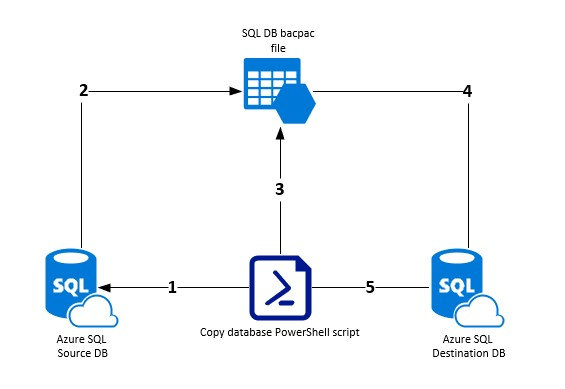
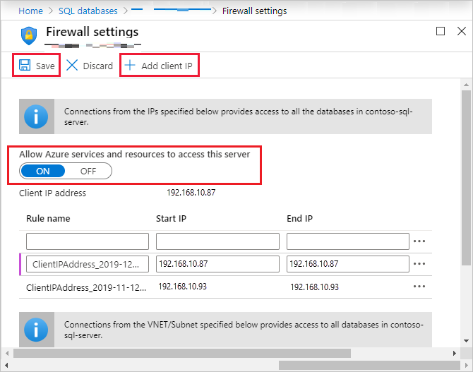

# Copy Azure database between stages



Goal of this article is to show you how to easily migrate database between two Azure SQL Servers.
It can be usefull in scenarios where you need to have exact configuration on two environments and want to have it done in automatic way.

## What services are needed to have solution working properly?

The only service which is mandatory (besides two Azure SQL Servers) is Azure Storage Account, on which bacpac files will be stored. It's up to you how you will configure this storage, as there aren't any specific requirement. 

## How the process of migration looks like?

As you probably saw on main picture of this article the process is quite easy:

1. Script initialize connection to source database.
2. Script is starting export of bacpac file from source database to storage account.
3. Script checks if bacpac was properly created.
4. Script is starting import of bacpac file to destination database from storage account.
5. Script validate if process of importing bacpac file finished with success.

## Prerequisites

1. Az module installed on platform on which script will be run (eg. your local PC, Azure DevOps pipeline, Azure Automation)
```powershell
Install-Module -Name Az -Force
```
2. Firewall rule added on SQL Server (if you are using local PC) or option "Allow Azure services and resources to access this server" in case you use some other Azure service to run the script.

3. Blob container called "bacpacs" created on storage account.

### From Service provider team perspective


1. Service provider tenant user which is added to proper group get access to **My Cusotmers** tab in Azure Lighthouse
2. Can see all customers which are assigned to him.
3. Can check AAD Group Membership and related role at the customer destination subscription.
4. Can check access to customer resource

### From customer perspective


1. Customer get access to new tab in Azure Lighthouse **Service Providers**
2. Can see all service providers
3. Display exact delegations for each provider
4. Check offer details and correlated assigned role

## Prerequisites
1. Az PowerShell Module installed
2. Account with Owner role in customer tenant
3. Access to create and configure Azure Active Directory groups in Manged Service Provider tenant

## Service Provider ARM template

To deploy desired configuration in customer tenant below template must be used.

In such ARM template we basically do the mapping between groups created earlier in Azure AD of Managed Service Provider tenant and role IDs defined in customer tenant.

To check role defintion ID use Powershell command
```powershell
(Get-AzRoleDefinition -Name "Name_of_the_role").Id
```

To check Azure Active Directory group ID use Powershell command
```powershell
(Get-AzADGroup -Name "Name_of_the_AAD_group").ObjectId
```

If you don't have yet groups created you can simply create them with following script:
```powershell
param(
    $TenantID,
    $CustomerName
)

Connect-AzAccount -Tenant $TenantID

$groups = @(
    "Logs-Reader", 
    "Customer-Reader", 
    "Customer-Contributor"
)

foreach ($group in $groups) {
    $groupName = "Lighthouse-$CustomerName-$group"
    $aadGroup = Get-AzADGroup -DisplayName $groupName

    if ($aadGroup) {
        Write-Output "Group $groupName already exists."
    }
    else {
        Try {
            New-AzADGroup -DisplayName $groupName -MailNickname $groupName
            Start-Sleep -s 5
            $aadGroup = (Get-AzADGroup -DisplayName $groupName).ObjectId
            Write-Output "AAD Group $groupName with id $aadGroupId created with success"
        }
        Catch {
            Write-Output "Unexpected error occured during AAD group creation. Error: $($_.exception.Message)"
        }
        
    }
  
}
```

Here you can find short description of each parameter in ARM:

* **mspOfferName** - name of the offer from the Managed Service Provider
* **mspOfferDescription** - name of the Managed Service Provider offering
* **managedByTenantId** - Managed Service Provider tenant ID
* **authorizations** - in this part you should provide array according to how you want to configure access in Azure Lighthouse. 

```ARM
"parameters": {
    "mspOfferName": {
        "value": ""
    },
    "mspOfferDescription": {
        "value": ""
    },
    "managedByTenantId": {
        "value": ""	
    },
    "authorizations": {
        "value": [
            {
                "principalId": "000000-0000-00000-0000-0000000",
                "principalIdDisplayName": "Logs Reader",
                "roleDefinitionId": "73c42c96-874c-492b-b04d-ab87d138a893"
            },
            {
                "principalId": "000000-0000-00000-0000-0000000",
                "principalIdDisplayName": "Customer Reader",
                "roleDefinitionId": "acdd72a7-3385-48ef-bd42-f606fba81ae7"
            },
            {
                "principalId": "000000-0000-00000-0000-0000000",
                "principalIdDisplayName": "Customer Contributor",
                "roleDefinitionId": "b24988ac-6180-42a0-ab88-20f7382dd24c"
            }
        ]
    }
}
```

In order to deploy such ARM you can simply use **New-AzDeployment** from PowerShell Az module.

**IMPORTANT!**

Remember that you must be logged to customer tenant to deploy ARM template, not Managed Service Provider tenant.

## Things to have in mind before applying this solution
1. Decide how you want to manage access to your customers. Do you want to have same groups for all of them or separate one?
2. Decide which roles are necessary for you and split them correctly - you can always do it later however it's best to have solution ready from the beginning.