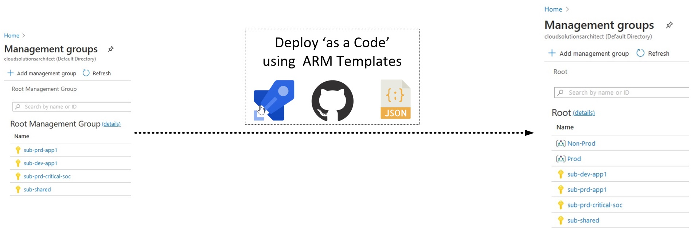
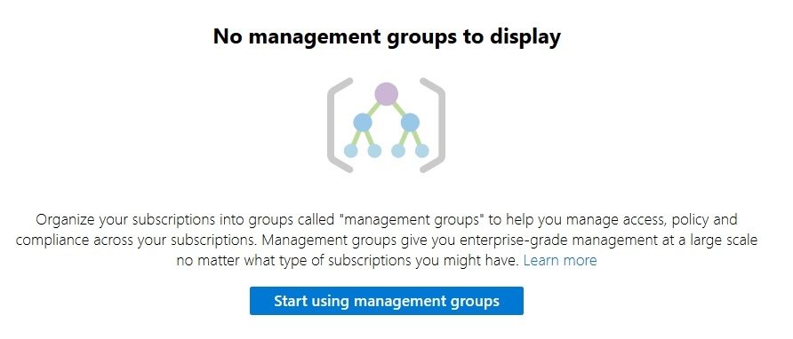
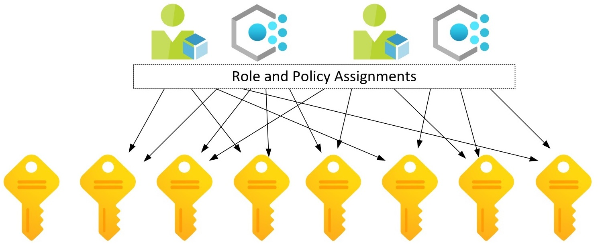
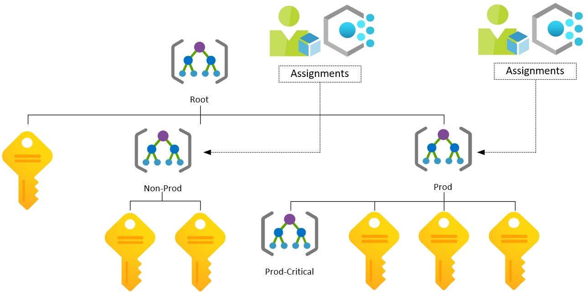

# Deploy Management Group Hierarchy as a Code



In our article, we'll rename the Root Management Group, create two child MG's and one 'child of a child' MG. Although it is possible to place Subscription inside MG using ARM Templates, we will not make it that way. Our approach is to make it by script. We will cover this topic in one of the future posts.

!!! Success "Managemet Groups deployemtnt with tempales is pretty new"

Support for deploying Azure Management Groups with Resource Manager Template has been introduced recently. Previously there was no built-in functionality to deploy them using declarative way. The best option to create the MG hierarchy 'as a code' until now was Tao's script. It also includes subscription placement automation based on Regex, so it's still worth checking it!

[Configuring Azure MG using Azure DevOps by Tao Yang](https://blog.tyang.org/2019/09/08/configuring-azure-management-group-hierarchy-using-azure-devops/)

!!! warning "Read before deployment"
    - Management Groups must be deployed at the Tenant Scope

    - Root MG can be renamed using our ARM Template

    - 'Start using MG' muse be done to proceed

    

## Before




### Create Service Principal and assign Owner role

``` powershell
$spDisplayName = 'mgHierarchy'
$tenantId = '33369038-1d6a-4577-955e-debbde0cd093'
$sp = New-AzADServicePrincipal -DisplayName $spDisplayName -Scope '/' -Role Owner

$credentials = New-Object -TypeName PSCredential -ArgumentList $sp.ApplicationId, $sp.Secret
Connect-AzAccount -ServicePrincipal -Credential $credentials -Tenant $tenantId

```

## Folders And Files Structure

```
|   Deploy-ArmTemplates.ps1
|   ManagementGroupsHierarchy.DeploymentDefinition.json
\---ManagementGroups
        ManagementGroup.json
        ManagementGroup.Root.Parameters.json
        ManagementGroup.Prod.Parameters.json
        ManagementGroup.NonProd.Parameters.json
        ManagementGroup.ProdCritical.Parameters.json
```

## Management Group ARM Template

We will keep up to date ARM Template for Management Groups on GitHub repo: 

[ARM Templates GitHub Repository](https://github.com/kwiecek/arm-templates )

??? note "ManagementGroup.Root.Parameters.json"
    ``` json
    {
        "$schema": "https://schema.management.azure.com/schemas/2019-08-01/tenantDeploymentTemplate.json#",
        "contentVersion": "1.0.0.0",
        "parameters": {
            "name": {
                "type": "string",
                "metadata": {
                    "description": "Management Group ID."
                }
            },
            "displayName": {
                "type": "string",
                "defaultValue": "",
                "metadata": {
                    "description": "The friendly name of the management group. If no value is passed then this field will be set to the groupId."
                }
            },
            "parentId": {
                "type": "string",
                "defaultValue": "",
                "metadata": {
                    "description": "The fully qualified ID for the parent management group. For example, /providers/Microsoft.Management/managementGroups/0000000-0000-0000-0000-000000000000. Create management group under root or modify root display name if empty."
                }
            }
        },
        "functions": [
        ],
        "variables": {
        },
        "resources": [
            {
                "name": "[parameters('name')]",
                "type": "Microsoft.Management/managementGroups",
                "apiVersion": "2020-02-01",
                "properties": {
                    "displayName": "[if(empty(parameters('displayName')),json('null'),parameters('displayName'))]",
                    "details": {
                        "parent": {
                            "id": "[if(empty(parameters('parentId')),json('null'),parameters('parentId'))]"
                        }
                    }
                },
                "resources": [
                ]
            }
        ],
        "outputs": {
        }
    }
    ```


### Management Groups Naming

Id/Name         | Value
:-------------- |:-------------
Tenant          | 11111111-1111-1111-1111-111111111111
Root            | 1111111-1111-1111-1111-1111111111111
Prod            | 2222222-2222-2222-2222-2222222222222
Non-Prod        | 3333333-3333-3333-3333-3333333333333
Prod-Critical   | 4444444-4444-4444-4444-4444444444444

## Parameter Files

- If you do not provide the Name/Id of the parent MG and the name parameter is equal to Tenant Id, then you configure Root MG. 

??? note "ManagementGroup.Root.Parameters.json - rename 'Root Management Group' to 'Root'"
    ``` json
    {
        "$schema": "https://schema.management.azure.com/schemas/2019-04-01/deploymentParameters.json#",
        "contentVersion": "1.0.0.0",
        "parameters": {
            "name": {
                "value": "1111111-1111-1111-1111-1111111111111"
            },
            "displayName": {
                "value": "Root"
            },
            "parentId": {
                "value": ""
            }
        }
    }    
    ```

- If the name is different than Tenant ID, then you create child MG under Root MG.

??? note "ManagementGroup.Prod.Parameters.json - create 'Prod' MG under 'Root'"
    ``` json
    {
        "$schema": "https://schema.management.azure.com/schemas/2019-04-01/deploymentParameters.json#",
        "contentVersion": "1.0.0.0",
        "parameters": {
            "name": {
                "value": "2222222-2222-2222-2222-2222222222222"
            },
            "displayName": {
                "value": "Prod"
            },
            "parentId": {
                "value": ""
            }
        }
    }    
    ```

??? note "ManagementGroup.NonProd.Parameters.json - create 'Non-Prod' MG under 'Root'"
    ``` json
    {
        "$schema": "https://schema.management.azure.com/schemas/2019-04-01/deploymentParameters.json#",
        "contentVersion": "1.0.0.0",
        "parameters": {
            "name": {
                "value": "3333333-3333-3333-3333-3333333333333"
            },
            "displayName": {
                "value": "Non-Prod"
            },
            "parentId": {
                "value": ""
            }
        }
    }    
    ```

- If you want to create MG under non-root MG, then you need to specify parent MG. It must be its fully qualified ID.

??? note "ManagementGroup.ProdCritical.Parameters.json - create 'Prod-Critical' MG under 'Prod'"
    ``` json
    {
        "$schema": "https://schema.management.azure.com/schemas/2019-04-01/deploymentParameters.json#",
        "contentVersion": "1.0.0.0",
        "parameters": {
            "name": {
                "value": "4444444-4444-4444-4444-4444444444444"
            },
            "displayName": {
                "value": "Prod-Critical"
            },
            "parentId": {
                "value": "/providers/Microsoft.Management/managementGroups/2222222-2222-2222-2222-2222222222222"
            }
        }
    }    
    ```


## How it will be deployed?


We deploy templates using universal, multi-scope PowerShell deployment script. The script's code is available on GitHub repo. 

[ARM Templates GitHub Repository](https://github.com/kwiecek/azure-arm-deployment-script)

Here you can find details about our motivation and concept:

[Deploy ARM Templates at Any Scope With Universal Script](/azure-arm-deployment-script)


## Deploy!

??? note "ManagementGroupsHierarchy.DeploymentDefinition.json"
    ``` json
    [
        {
            "Order": 1,
            "TenantId": "1111111-1111-1111-1111-1111111111111",
            "TemplateFile": "ManagementGroups\\ManagementGroup.json",
            "TemplateParameterFile": "ManagementGroups\\ManagementGroup.Root.Parameters.json"
        },
        {
            "Order": 2,
            "TenantId": "1111111-1111-1111-1111-1111111111111",
            "TemplateFile": "ManagementGroups\\ManagementGroup.json",
            "TemplateParameterFile": "ManagementGroups\\ManagementGroup.Prod.Parameters.json"
        },
        {
            "Order": 3,
            "TenantId": "1111111-1111-1111-1111-1111111111111",
            "TemplateFile": "ManagementGroups\\ManagementGroup.json",
            "TemplateParameterFile": "ManagementGroups\\ManagementGroup.ProdCritical.Parameters.json"
        },
        {
            "Order": 4,
            "TenantId": "1111111-1111-1111-1111-1111111111111",
            "TemplateFile": "ManagementGroups\\ManagementGroup.json",
            "TemplateParameterFile": "ManagementGroups\\ManagementGroup.NonProd.Parameters.json"
        }
    ]
    ```

``` powershell
.\Deploy-ArmTemplates.ps1 -DeploymentDefinitionsPath .\ManagementGroupsHierarchy.DeploymentDefinition.json
```

## Result




## Author


**Kamil Więcek** is twentynine years old IT passionate that will continue to learn, do home projects and practicing new technologies even if he becomes a multimillionaire. 
Big fan of the following sentence: "if you describe a process mentioning someone's name, then it is not automated."
