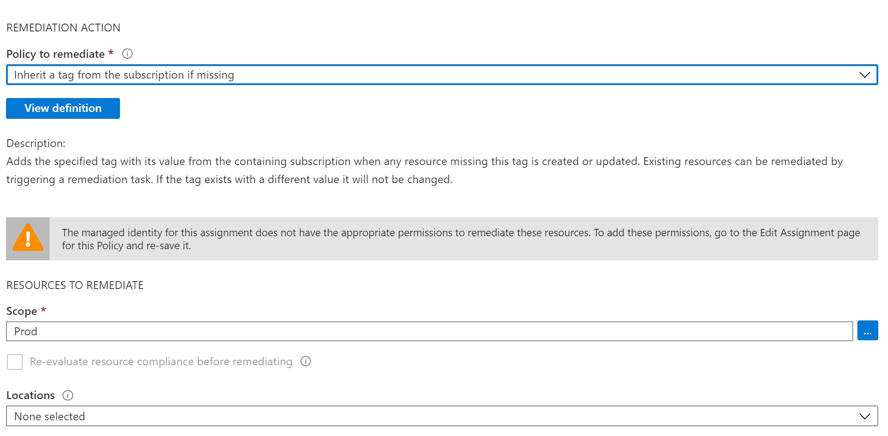
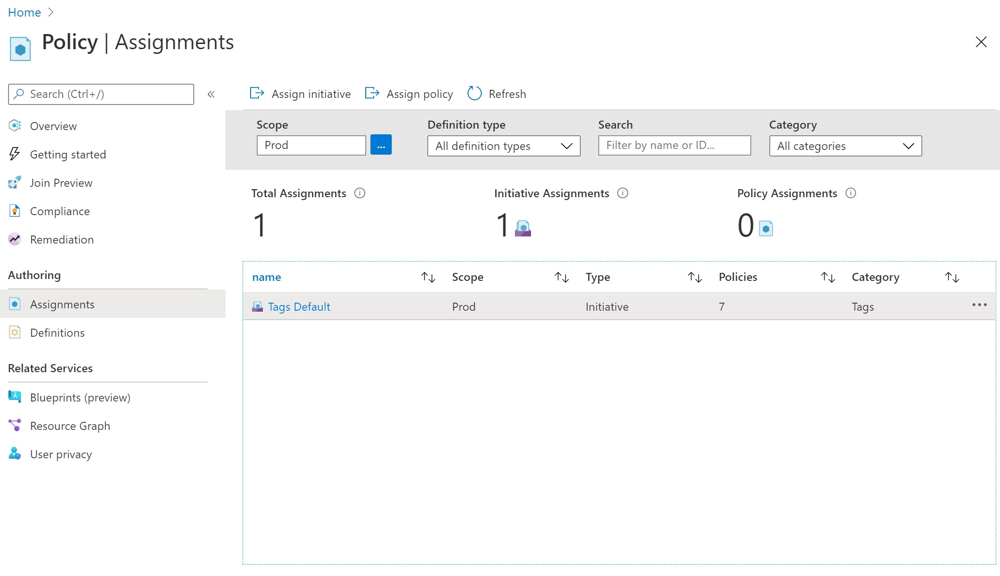
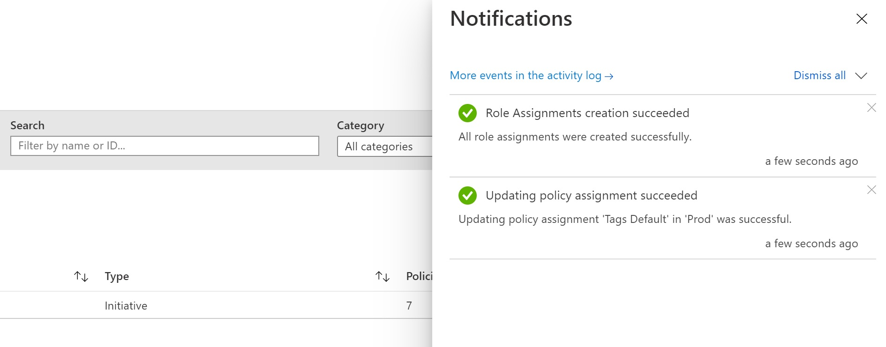
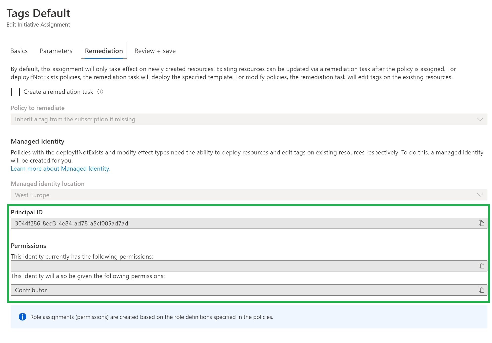
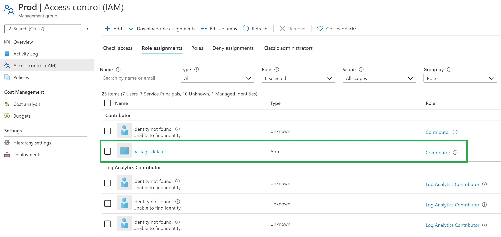
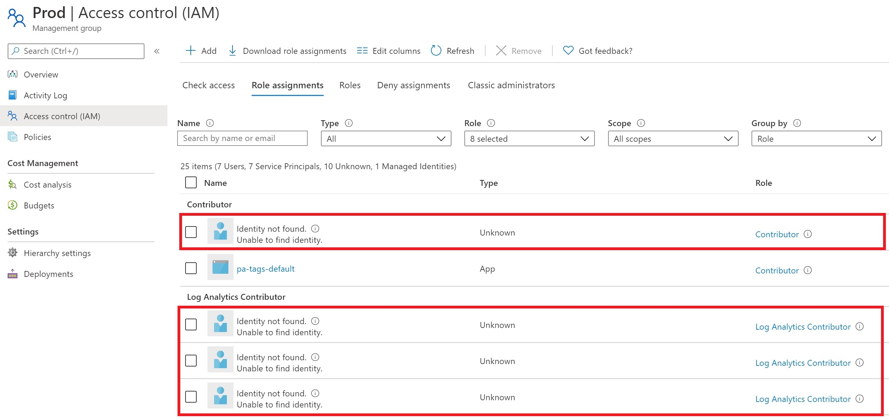
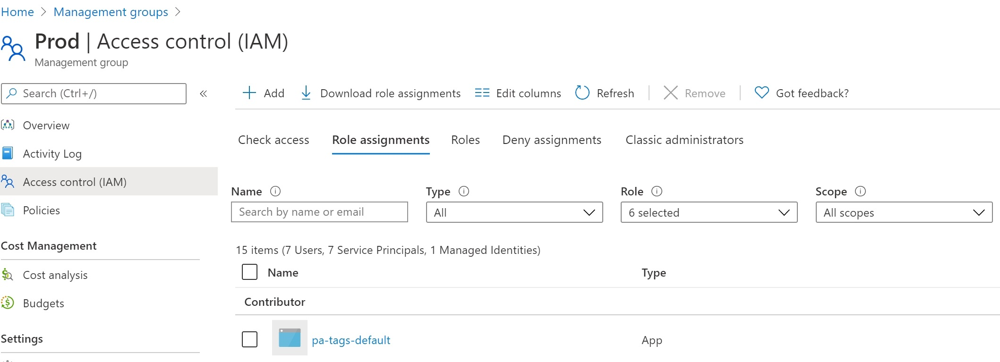

# Fix and cleanup MSI role assignments for policy assignments at the management group level




## Problem statement

!!! danger "Missing role assignment error"
    "The managed identity for this assignment does not have the appropriate permissions to remediate these resources. To add these permissions, go to the Edit Assignment page for this Policy and re-save it."

I can agree with the first part of the statement. But the second part is correct only partially, so I decided to write this post.

Long story short. If you deploy **Azure Policy/ Azure Initiative assignment** at Azure Management Group level in **non-portal** way, then You need to **take care of role assignment for MSI** created during an assignment on your own. Append, DeployIfNotExists, or Modify effects for your Azure Policy force Azure to create Azure Managed Service Identity during Policy assignment. Your assignment goal will be achieved by using the permission of this identity.

## Three ways you can use to fix it!

### 1 - Clicking via Portal!



Click, click, click.




Forgive me, mentioning it. Please always chose a declarative approach or at least a script approach! 

Otherwise: **Shame on you!**


### 2 - Powershell script (a litte bit better)

??? note "Show Fix-PolicyAssignmentsMsiRoleAssignment.ps1 script" 

    ``` powershell
        param (
            $ManagementGroupName
        )

        $ErrorActionPreference = 'Stop'

        $context = Get-AzContext

        if (-not $context) {
            Write-Error -Exception "Login to Azure first!"
        }

        $context = Get-AzContext

        if (-not $context) {
            Write-Error -Exception "Login to Azure first!"
        }

        # use this if you run this script in a pipeline
        # $token = ($context.TokenCache.ReadItems() | Sort-Object -Property ExpiresOn -Descending)[0].AccessToken

        # use this when running locally
        $context = Get-AzContext
        $azureRmProfile = [Microsoft.Azure.Commands.Common.Authentication.Abstractions.AzureRmProfileProvider]::Instance.Profile;
        $rmProfileClient = New-Object Microsoft.Azure.Commands.ResourceManager.Common.RMProfileClient($azureRmProfile);
        $token = $rmProfileClient.AcquireAccessToken($context.Subscription.TenantId).AccessToken;


        $headers = @{
            'Host' = 'management.azure.com'
            'Content-Type' = 'application/json';
            'Authorization' = "Bearer $token";
        }

        $rootScope = [psobject]@{
            id = "/providers/Microsoft.Management/managementGroups/$( $ManagementGroupName  )" 
        }

        $mgUri = "https://management.azure.com/providers/Microsoft.Management/managementGroups/$( $ManagementGroupName )/descendants?api-version=2020-02-01"

        $result = Invoke-RestMethod -Uri $mgUri -Headers $headers -Method Get

        $scopes = $result.value
        $scopes += $rootScope 

        $assignmentsForRbacFix = @()

        foreach ($scope in $scopes) {
            Write-Output -InputObject "Looking for assignments requiring permissions in scope $( $scope.id )"
            
            #fitler out inherited assignments and Azure Security Center
            $assignments = Get-AzPolicyAssignment -Scope $scope.id -ErrorAction SilentlyContinue | Where-Object -FilterScript { 
                $_.Properties.Scope -eq $scope.id -and `
                -not $_.ResourceId.EndsWith('SecurityCenterBuiltIn') -and `
                $_.Identity
            }

            $assignmentsForRbacFix += $assignments
        }


        foreach ($assignmentRbacFix in $assignmentsForRbacFix) {
            $msiObjectId = $assignmentRbacFix.Identity.principalId

            $policyDefinitions = @()

            $policyDefinition = Get-AzPolicyDefinition -Id $assignmentRbacFix.Properties.PolicyDefinitionId -ErrorAction SilentlyContinue

            if ($policyDefinition) {
                $policyDefinitions += $policyDefinition #not tested without initiative!
            } else {
                $policySetDefinition = Get-AzPolicySetDefinition -Id $assignmentRbacFix.Properties.PolicyDefinitionId
                $policyDefinitions += $policySetDefinition.Properties.PolicyDefinitions | % { Get-AzPolicyDefinition -Id $_.PolicyDefinitionId }
            }

            $requiredRoles = @()

            foreach ($policy in $policyDefinitions) {
            
                foreach ($roleDefinitionId in $policy.Properties.PolicyRule.Then.Details.RoleDefinitionIds) {
            
                    $roleId = ($roleDefinitionId  -split "/")[4]
                    
                    if ($requiredRoles -notcontains $roleId) {
                        $requiredRoles += $roleId 
                    }
                }
            }

            #cleanup role assignments
            Get-AzRoleAssignment -Scope $assignmentRbacFix.Properties.Scope | Where-Object -Property ObjectType -EQ 'Unknown' | % {
                Remove-AzRoleAssignment -InputObject $_
                Write-Output -InputObject "Removed role assignment: $( $_ | ConvertTo-Json -Compress )"
            }

            foreach ($roleDefinitionId in $requiredRoles) {
                $roleAssignment = Get-AzRoleAssignment -Scope $assignmentRbacFix.Properties.Scope -ObjectId $msiObjectId -RoleDefinitionId  $roleDefinitionId

                if (-not $roleAssignment ) {
                    $roleAssignment = New-AzRoleAssignment -Scope $assignmentRbacFix.Properties.Scope -ObjectId $msiObjectId -RoleDefinitionId $roleDefinitionId -ErrorAction Stop
                    Write-Output -InputObject "Added role assignment: $( $roleAssignment | ConvertTo-Json -Compress )"
                }            
            }
        }

    ```

``` powershell
git clone https://github.com/kwiecek/azure-devsecops
cd .\azure-devsecops\
.\scripts\Fix-PolicyAssignmentsMsiRoleAssignment.ps1 -ManagementGroupName '2222222-2222-2222-2222-2222222222222'
```

Feel free to use this script. How does it work? You provide MG to crawl, and then script:

- checks Azure Policy and Initiative assignments for this MG and all child 

- figures out what is the MSI ObjectId and what roles are required



- assigns required roles for MSI



- removes role assignments for removed assignments:
  


### 3 - ARM Templates - the best way!.

I assume you deploy assignments with ARM Tempaltes, so add roleAssignment resource to your deployment:

``` json
{
    "type": "Microsoft.Authorization/roleAssignments",
    "apiVersion": "2018-09-01-preview",
    "name": "[variables('roleName')]",
    "properties": {
        "roleDefinitionId": "[variables('roleDefinitionId')]",
        "principalId": "XXX"
    }
}
```

Checkout out [Stephane Lapointe ](https://www.codeisahighway.com/author/stephane-lapointe/) article about a [new way to reference managed identity in ARM template](https://www.codeisahighway.com/there-is-a-new-way-to-reference-managed-identity-in-arm-template/) for more details.

## And... we got it!



## Author


**Kamil Więcek** is twenty-nine years old IT passionate who will continue to learn, do home projects, and practice new technologies even if he becomes a multimillionaire. 
Big fan of the following sentence: "if you describe a process mentioning someone's name, then it is not automated."
