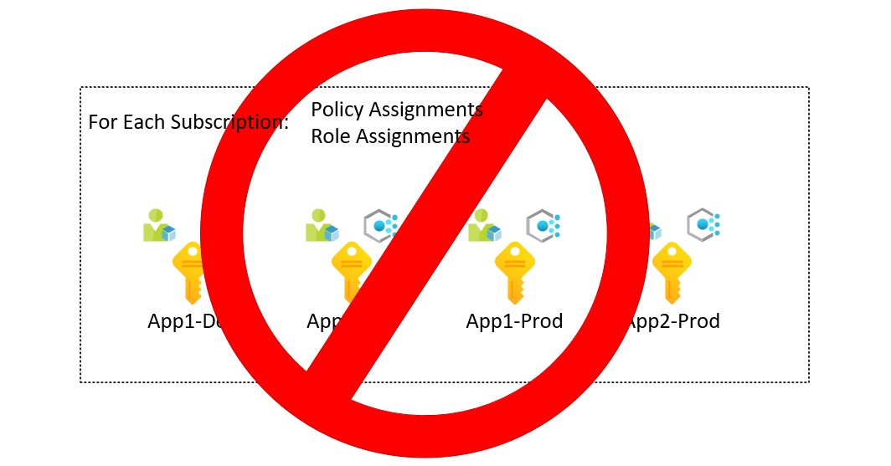
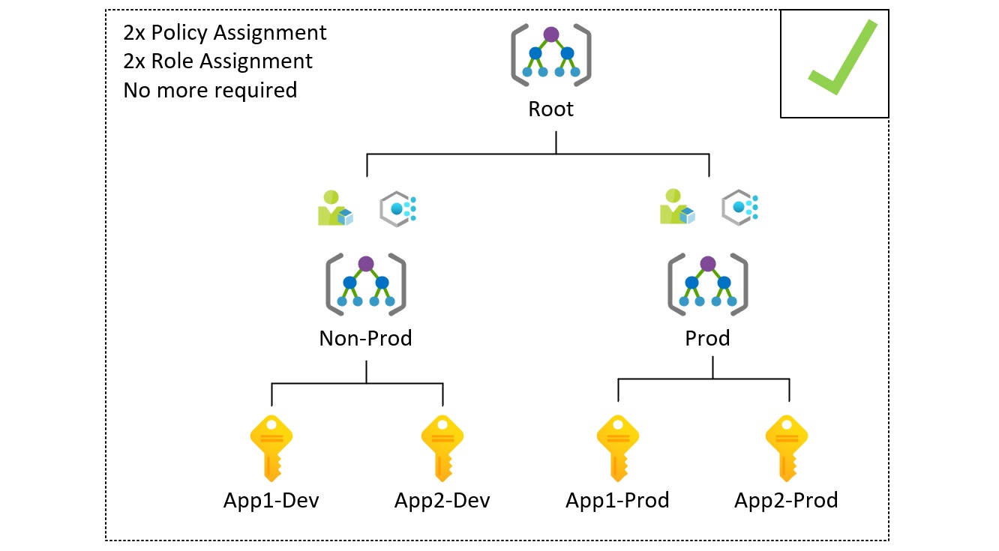
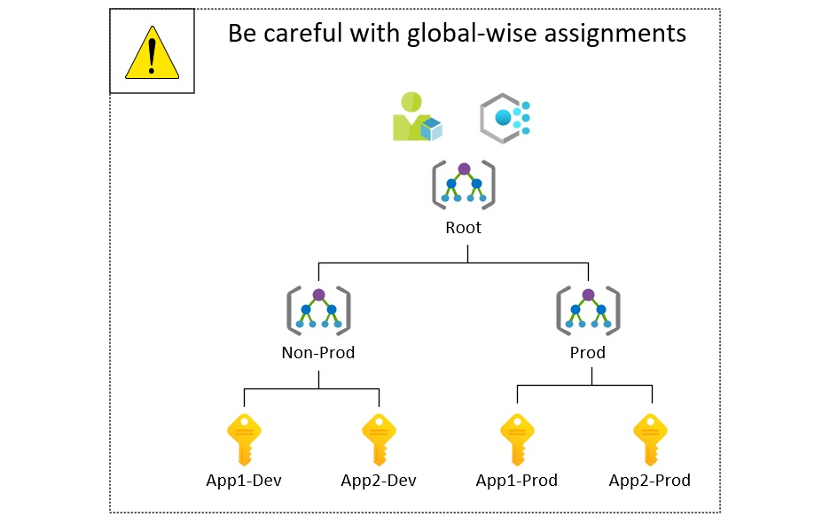

# Azure Management Groups Hierarchy - Best Practises and Overview

<!--  -->

In an enterprise-scale, we deal with multiple projects, applications, environments, R&D initiatives, proofs of concept. 
Therefore the **number of workloads** running on in the cloud is snowballing. 
A good approach is to divide workloads into separate subscriptions. Thanks to Management Groups **assigning policies and permissions** management across **multiple Azure subscriptions** are no longer painful. 

This article explains the concept, summarizes best practices, and shows how you can automate Management Group hierarchy deployment.

!!! info
    After reading the 'why' section, you might realize that your scale doesn't require multiple subscriptions and management group hierarchy. It is a reasonable choice to follow 'keep it simple stupid' rule then. 

## What will you get without any additional costs?
- Centralized management
- Subscriptions grouping
- Apply **policies**, **access control**, and blueprints
- Level of scope over resource groups and subscriptions 
- **Inheritance** of governance artifacts
- Compliance and cost reporting by organizations

## Is it a must or rather than a choice? Why?
- Subscription CRUD process won't stop, dozens or even hundreds of subscriptions can be managed without extra effort
- The efficiency of governance is not possible at **scale** without MG
- It is simpler to assign roles and apply policies to multiple subscriptions when they are grouped into MG
- You cannot leave new subscription as it is, Azure Policy and role assignments should cover them
- Avoid administration re-work and configuration drift

## The most important technical details.

!!! danger
    Be careful with enforcing configuration at the Root level.  It allows global policies and RBAC assignments. Therefore if you deny something at this level, then it won't be possible to use it in the entire structure. Every item you want to apply here must be tested before applying.

- One management group hierarchy per tenant
- The top-level group is Root, and it cannot be removed, its Id equals to Tenant Id
- New subscriptions are created in Root MG 
- User Access Administrator can manage Root MG after elevation
- One child to parent and one parent to multiple child relations 
- Hierarchy can be six levels of depth
- Child subscriptions and groups inherit RBAC and policy
- New subscriptions will be governed automatically
- 10,000 groups can be created

## Best practices

- Apply critical, non-negotiable controls ar the Root Management Group, for example, regulatory requirements.
- Limit management group depth, use **two, or three levels** should be enough in most scenarios.
- Do segmentation properly. **Identify** subscriptions that should **share** the RBAC model and Policies, avoid overlapping.
- Create an additional segment for testing purposes. Test the impact on a lower number of subscriptions before applying changes to scale.

## Author

**Kamil Więcek** is twentynine years old IT passionate that will continue to learn, do home projects and practicing new technologies even if he becomes a multimillionaire. 
Big fan of the following sentence: "if you describe a process mentioning someone's name, then it is not automated."
