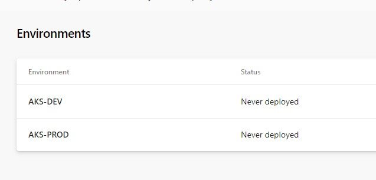

# Multi-Stage YAML Pipeline Configuration


Since May 2019 Microsoft offer as a part of Azure DevOps service Multi-Stage YAML pipelines.
Probably you will ask what is a difference between standard approach of CICD process and Multi-Stage?
Answer is pretty simple - in standard approach only CI (build) part of CICD process was possible to define as YAML definition.
Multi-Stage YAML pipelines (name of it is bacially self explanatory) approach allows to define both CI (build) and CD(release) processes in YAML language.

## Ok, but why I should use it if I can easly click everything in portal?

Of course you can do everything via GUI, but common why not take one step forward and define your pipeline as a code?
How cool it can be if you are defining not only infrastructure as a code but also your whole CICD process?

If I didn't encourage you yet to using this funcionality, below you can find more advantages of using it:

- **Diff option** - you can compare the definition which are failing with the last known good configuration.
  
- **History** - source control allows you to see every change which was done to your pipeline since the initial creation.
  
- **Rollback** - if you found that your last commit causing any problem during deployment, simple roll it back to last good configuration.
  
- **Reusability option** - how often you wanted to reuse pipeline which is already defined? - now you can simply do that by copy/paste option.

- **Team cooperation** - if there are multiple people working on same pipeline it can cause problem using GUI, using YAML team members can work on separate branch and adjust definition according to their needs.

## Sounds good, but what if I don't have experience with YAML language?

If you think it is problem you are totally wrong.
YAML is not complicated - if you ever define Azure resource definition using Azure Resource Manager (ARM template) you will for sure be able to easily write YAML pipelines.

<PICTURE OF YAML>

## How to get started with Multi-Stage YAML pipelines?

Let me guide you step by step how to configure such pipeline.

In my example I will show you how to configure Azure Kubernetes Service with some additional tools which are usefull during application deployment.

Later you can adjust it to your needs by changing specific task - however overall process of creation will be basically the same.

### Prerequisites

In my scenario I will shouw you how to setup additional tools on **Azure Kubernetes Service cluster**.
Following prerequisites should be met:

- At least one AKS cluster should be created
- Proper permission assigned for AKS cluster - best to have Owner


In first step we need to define environment in Azure Dev Ops for each cluster.
Go to **Pipeline->Environment->Create Environment**
Type the name of the environment, provide description and choose **Kubernetes** as a resource and click Next.


In next window choose subscription and AKS cluster which you want to add for specific environment. Define also namespace which should be used and click validate and create.


Once it's done you should see AKS cluster added to environment. Repeat above steps if you want to add additional AKS clusters.



You should also configure variable group which should look like on below picture.
Of course values for environments and service connections should be adjusted to your configuration.


## YAML configuration

Once we have environment configured we can start with configuration of YAML files.

### Build configuration

As a first step we should define build pipeline **azure-pipelines.yaml**.
In our scenario it will be quite easy and yaml will look like this:

```yaml
variables:
- group: AKSBuildVariables

stages:
- stage: Build
  jobs:
  - job: Build
    pool:
      vmImage: 'windows-2019' 
    continueOnError: true
    steps:
    - checkout: self
      clean: true
      persistCredentials: true 
    - task: PublishPipelineArtifact@1
      inputs:
        path: $(System.DefaultWorkingDirectory)
        artifact: yaml
        
- template: deploy-to-all-stages.yaml

```

As a variables we are using variable group defined in prerequisites step.
It will be used for gathering all sensitive data in encrypted way.

The main thing we will do here is publish all files as artifacts of this build.

At the end of above yaml there is template **deploy-to-all-stages.yaml** which will be used for caling specific stages.

### deploy-to-all-stages.yaml configuration

```yaml
stages:
- template: deployment-stage.yaml
  parameters:
    STAGE_NAME: DEV
    STAGE_ENVIRONMENT: $(DEV_ENVIRONMENT_NAME)
    STAGE_K8S_SERVICE_ENDPOINT: $(DEV_CLUSTER_SERVICE_CONNECTION_NAME)

- template: deployment-stage.yaml
  parameters:
    STAGE_NAME: PROD
    STAGE_ENVIRONMENT: $(PROD_ENVIRONMENT_NAME)
    STAGE_K8S_SERVICE_ENDPOINT: $(PROD_CLUSTER_SERVICE_CONNECTION_NAME)
```

As you can see here we are specifing configuration for each stage.
We can use different deployment template depends on scenario we want to implement.

To make it easier I will use same template file for both stages, only input parameters will be different.
Parameters will be taken directly from variable group defined in build part.
If you want to use different variable group for each environment you can define them as well on deployment template level.

Once you have file with stages defined, it's time to create main deployment template.
In our case it will be called **deployment-stage.yaml**.

### deployment-stage.yaml configuration

```yaml
parameters:
  STAGE_NAME: ''
  STAGE_ENVIRONMENT: ''
  STAGE_K8S_SERVICE_ENDPOINT: ''

stages:
- stage: ${{ parameters.STAGE_NAME }}
  jobs:  
  - deployment: SetupCluster
    pool: 
      vmImage: 'ubuntu-latest'
    environment: ${{ parameters.STAGE_ENVIRONMENT }}
    strategy: 
      runOnce:
        deploy:
          steps:
          - task: DownloadPipelineArtifact@2
            inputs:
              artifactName: yaml
              targetPath: $(Build.SourcesDirectory)/yaml

          - task: HelmInstaller@1
            inputs:
              helmVersionToInstall: '2.14.3'
        
          - task: Kubernetes@1
            displayName: Configure custom role
            inputs:
              connectionType: 'Kubernetes Service Connection'
              kubernetesServiceEndpoint: ${{ parameters.STAGE_K8S_SERVICE_ENDPOINT }}
              command: 'apply'
              arguments: '-f $(Build.SourcesDirectory)/yaml/configure-custom-role.yaml.yaml'
         
          - task: Bash@3
            displayName: "Repo add nginx"
            inputs:
              targetType: 'inline'
              script: 'helm repo add nginx-stable https://helm.nginx.com/stable'
        
          - task: Bash@3
            displayName: "Repo update"
            inputs:
              targetType: 'inline'
              script: 'helm repo update'  
```

Deployment stage template starts with input parameters. 
Values of those parameters are taken from **deploy-to-all-stages.yaml** separately for each stage.
To use input parameters please fallow syntax like below:

**${{parameters.INPUT_PARAMETER }}**

Next we are defining vm image on which deployment will take place and main configuration is done.

In deploy section we provide tasks which should be used in our release.

In our case we will perform following operations:
- Download artifacts from build
- Install Helm tool
- Create a custom role and assign it to group system:serviceaccounts
- Download nginx (without installation) to repository on AKS node
- Update repository on AKS node

For third and last task we need additional yaml file 
to be added to our GIT reposiotry.

- **configure-custom-role.yaml**  
```yaml
kind: Role
apiVersion: rbac.authorization.k8s.io/v1
metadata:
  namespace: default
  name: azure-devops-deploy-role
rules:
- apiGroups: ["", "extensions", "apps"]
  resources: ["deployments", "replicasets", "pods", "services"]
  verbs: ["get", "list", "watch", "create", "update", "patch", "delete"]
---
kind: RoleBinding
apiVersion: rbac.authorization.k8s.io/v1
metadata:
  name: azure-devops-deploy-manager
  namespace: default
subjects:
- kind: Group
  name: system:serviceaccounts
  apiGroup: rbac.authorization.k8s.io
roleRef:
  kind: Role
  name: azure-devops-deploy-role
  apiGroup: rbac.authorization.k8s.io
```

### Linking a build yaml file in Azure DevOps

Ok, once we have everything prepared your GIT repo should looks like on below picture.


Let's go now to Azure DevOps and configure pipeline.

Go to Pipeline->Create Pipeline-> Azure Repos Git -> Select name of your repo -> Exisitng Azure Pipelines Yaml File -> Select azure-pipelines.yaml from your GIT repo and click on Run button.


As a result you should see that Multi-Stage YAML pipeline apply changes to all your clusters.


## Conclusion

In my example I shared with you scenario for AKS cluster configuration. 

Similar scenarios for deployment with ARM template usage can be done similar way without going deep dive into envrionments part.

Just wanted to show you how awesome are multi-stage YAML pipelines, hope that I ecourage you to use them ;)

