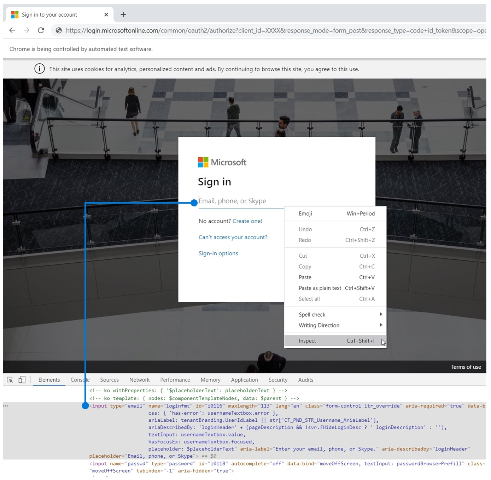
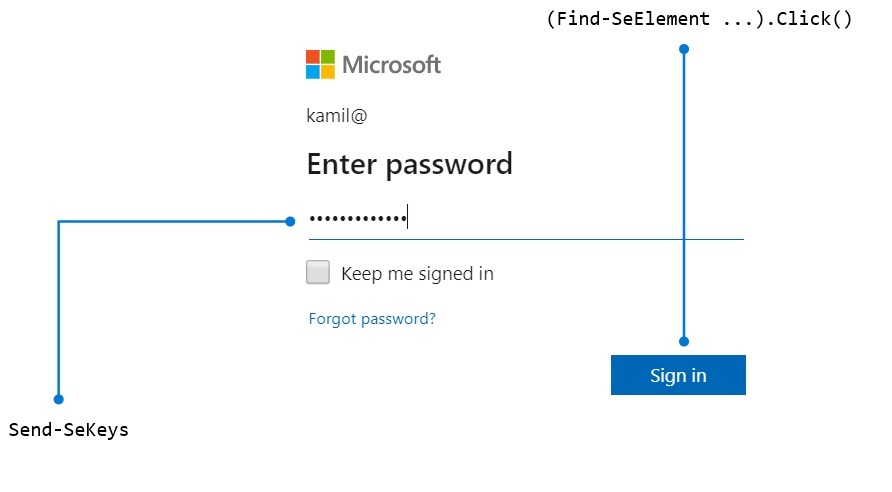

# Web browser automation with Powershell & Selenium

After reading this article, you should be able to write a basic web-automation script on your own. We hope you already have an idea where you want to use it.

```powershell
$cred = Get-Credential
.\New-AzPayAsYouGoSubscription.ps1 -Credentials $cred
```


## Important

Although this article shows how to automate creating a new PAYG subscription, it's goal is to present web automation with PowerShell and Selenium. Please consider the example script as a byproduct.

## First of all: it's easy!

You need [Powershell Selenium module from Powershell Gallery](https://www.powershellgallery.com/packages/Selenium/2.3.1).

```powershell
Install-Module -Name Selenium -RequiredVersion 2.3.1
```

Every single step of the entire automation process is more or less: 

1. Navigation to URL.
1. Waiting for one or more element/s like input, button, etc. to appear.
1. Doing action: filling a form, clicking a button, etc.

\* Steps 2 and 3 require you to know the way to identify elements.


## How to navigate to URL?

```powershell
$Url = 'http://example.com'
$Driver = Start-SeChrome
Enter-SeUrl -Driver $Driver -Url $Url
```


## How to identify elements?

Use developer tools included in your web browser. I use chrome. After clicking right on an element of interest, you need to select inspect. Then you'll get details and can decide whether to identify an item by id, class, etc.



```powershell
$UsernameElementName = 'loginfmt'
$NameElement = Find-SeElement -Driver $Driver -Name $UsernameElementName

```

## How to wait for the element to appear?

Any user knows that you need to see the button before you can click it. The same goes here.


```powershell
$PaygPlanElementClassName = 'plan_type_consumption'
$PaygPlanElement = Find-SeElement -Driver $Driver -ClassName 

while (-not $PaygPlanElement) {
    Write-Host -Object "Waiting for element class $( $PaygPlanElementClassName  )"
    Start-Sleep -Seconds 1
    $PaygPlanElement = Find-SeElement -Driver $Driver -ClassName $PaygPlanElementClassName 
}
```


## How to perform item-sepcific action?

``` powershell 
$PasswordElement = Find-SeElement -Driver $Driver -Name 'passwd'

while (-not $PasswordElement ) {
    Start-Sleep -Seconds 1
    $PasswordElement = Find-SeElement -Driver $Driver -Name 'passwd'
}

Send-SeKeys -Element $PasswordElement -Keys $Credentials.GetNetworkCredential().Password
(Find-SeElement -Driver $Driver -Id 'idSIButton9').Click()
```



## Do you want to perform more than one 'wait and click' operations in a row?
Use the following method if there is a need to perform the same action on elements that can be selected by the same property.

```powershell
$ElementsToClick = @('card-submit-button', 'no-support-option', 'attach-support-button')
foreach ($elementId in $ElementsToClick ) {
    do {
        $Element = Find-SeElement -Driver $Driver -Id $elementId

        if ($Element){
            try {
                $Element.Click()
            }
            catch {
                $Element = $null
            }
        }
        else {
            Write-Host -Object "Waiting for element id $( $elementId )"
            Start-Sleep -Seconds 1
        }
    }
    while (-not $Element)
}
```


## Script
[https://github.com/automationgurus/automationgurus.github.io/blob/master/src/code/New-AzPayAsYouGoSubscription.ps1](https://github.com/automationgurus/automationgurus.github.io/blob/master/src/code/New-AzPayAsYouGoSubscription.ps1)

```powershell
param (
    $Credentials
)

Write-Host -Object "Start"

$Url = "https://account.azure.com/signup?showCatalog=True&appId=Ibiza_SubscriptionsOverviewBladeCommandBar" 
$Driver = Start-SeChrome
Enter-SeUrl -Driver $Driver -Url $Url

#Enter username

$UsernameElementName = 'loginfmt'
$UsernameElement = Find-SeElement -Driver $Driver -Name $UsernameElementName

while (-not $UsernameElement ) {
    Write-Host -Object "Waiting for element $( $UsernameElementName )"
    Start-Sleep -Seconds 1
    $UsernameElement = Find-SeElement -Driver $Driver -Name $UsernameElementName
}

Send-SeKeys -Element $UsernameElement -Keys $Credentials.UserName

(Find-SeElement -Driver $Driver -Id 'idSIButton9').Click()

#Select 'Personal Account'

$PersonalAccountElement = Find-SeElement -Driver $Driver -Id 'msaTile'
while (-not $PersonalAccountElement ) {
    Start-Sleep -Seconds 1
    $PersonalAccountElement = Find-SeElement -Driver $Driver -Id 'msaTile'
}

$PersonalAccountElement.Click()

#Enter password

$PasswordElementName = 'passwd'
$PasswordElement = Find-SeElement -Driver $Driver -Name $PasswordElementName 

while (-not $PasswordElement ) {
    Write-Host -Object "Waiting for element name $( $PasswordElementName  )"
    Start-Sleep -Seconds 1
    $PasswordElement = Find-SeElement -Driver $Driver -Name $PasswordElementName 
}

Send-SeKeys -Element $PasswordElement -Keys $Credentials.GetNetworkCredential().Password

(Find-SeElement -Driver $Driver -Id 'idSIButton9').Click()

#Select PAYG Plan

$PaygPlanElementClassName = 'plan_type_consumption'
$PaygPlanElement = Find-SeElement -Driver $Driver -ClassName $PaygPlanElementClassName |
    Where-Object -Property Text -like '*Pay-As-You-Go*'

while (-not $PaygPlanElement) {
    Write-Host -Object "Waiting for element class $( $PaygPlanElementClassName  )"
    Start-Sleep -Seconds 1
    $PaygPlanElement = Find-SeElement -Driver $Driver -ClassName $PaygPlanElementClassName |
        Where-Object -Property Text -like '*Pay-As-You-Go*'
}

$PaygPlanElement.Click() 

#Set Payment and support agreement

$ElementsToClick = @('card-submit-button', 'no-support-option', 'attach-support-button')
foreach ($elementId in $ElementsToClick ) {
    do {
        $Element = Find-SeElement -Driver $Driver -Id $elementId

        if ($Element){
            try {
                $Element.Click()
            }
            catch {
                $Element = $null
            }
        }
        else {
            Write-Host -Object "Waiting for element id $( $elementId )"
            Start-Sleep -Seconds 1
        }
    }
    while (-not $Element)
}

#Accept terms

$AgreeElementId = 'accept-terms-checkbox'
$AgreeElement = Find-SeElement -Driver $Driver -Id $AgreeElementId 

while (-not $AgreeElement) {
    Write-Host -Object "Waiting for element id $( $AgreeElementId  )"
    Start-Sleep -Seconds 1
    $AgreeElement = Find-SeElement -Driver $Driver -Id $AgreeElementId 
}

Send-SeKeys -Element $AgreeElement -Keys ' '

#Create subscription

$AcceptElementId = 'accept-terms-submit-button'

do {
    $AcceptElement = Find-SeElement -Driver $Driver -Id $AcceptElementId 

    if ($AcceptElement){
        try {
            $AcceptElement.Click()
        }
        catch {
            $AcceptElement = $null
        }
    }
    else {
        Write-Host -Object "Waiting for element id $( $AcceptElementId  )"
        Start-Sleep -Seconds 1
    }
}
while (-not $AcceptElement )

Write-Host -Object "End"
```

## Author


**Kamil Więcek** is twentynine years old IT passionate that will continue to learn, do home projects and practicing new technologies even if he becomes a multimillionaire. 
Big fan of the following sentence: "if you describe a process mentioning someone's name, then it is not automated."
