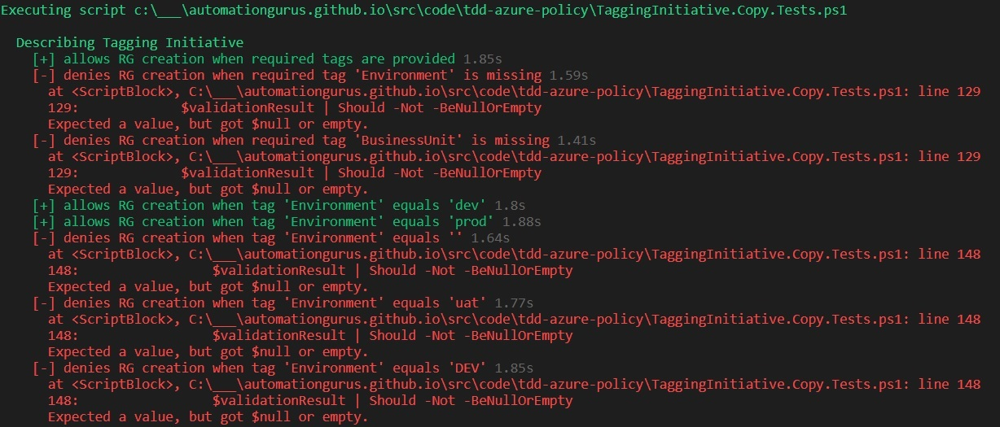

# Security and Compliance as a Code: Azure Policy Test-Driven Development


According to [Wardley Map of Security Skills required by Industry](https://medium.com/@marioplatt/security-for-the-2020s-the-skills-and-talent-problem-cc921533850f) Security and Compliance as a Code is now in Genesis. There can be no more exciting area to dive in. 

Generally speaking, we're inheriting more and more good practices known for years in the software development world. 

- We've already adopted using **source control repository** to store our script and declarative definitions of our infrastructures. 

- New tools are providing the capability to do static code analysis for non-classic programming languages. 

- Infrastructure deployment is now a **natural part of CD** processes. 

- Azure Marketplace is a place where you can find many tools supporting mentioned. What about the future? Let's start by using **test-driven development** in the process of **providing consistency** to our Azure subscriptions using **Azure Policy**.

### 'Who' is involved?

- Pester Powershell module

- Az.Resources Powershell module

- Azure Policy service

## Why develop automatic testing for Azure Policy? It's faster and more reliable.

1. You'll find errors earlier. Therefore, fully implemented, **well-working functionality** will be **delivered faster**!

1. When any new Azure Policy is created, it will be easy to check if current requirements are still adequately implemented. You'll do the next modifications without affright.

1. Finally, it **can be proved** that **tests have been performed**.

1. Are you able to test hundreds of tests in a couple of minutes using Azure Portal? 

## Test-Driven Development Process

1. Implement tests (only this is covered in this article).

1. Implement functionality.


## Show me that in action.

As always, we want to explain it to you better using a practical use case. So we want to govern Resource Group tagging. Let's say that there are some requirements defined. 


## More details

| Tag Name | Required? | Description | Example Value |
| - | - | - | - |
| Owner     | Yes | Owner's email address | kamil@automate.guru artur@automationgurus.github.io |
| Environment | Yes | Can be only dev or prod | dev, prod |
| BusinessUnit | Yes | Division/Area/Team, all parts must be filled n  | itdivision/appsarea/csharpteam |
| EndDate  | No | Decommissioning date (DDMMYYYY) | 29022024  |
| ItsmRequestId | No | Service Request's ID | sr0001, sr1990 |

A table and flow chart should be enough for you to understand what we want to achieve. Additional information: tag values must be lowercase, only allowed domains in the email address are 'automate.guru' and 'automationgurus.github.io'.


### Test procedure

1. Create hashtable with some valid and invalid values, also put information if a particular tag presence is required.
1. Assign initiative containing all policies enforcing business requirements at subscription scope.
1. Wait 30 minutes to be sure that all assignments are applied.
1. Use Test-Deployment Powershell to validate deployments in scenarios based on input from pt. 1.
1. Checks results.

### Azure Resource Group deployment validation function

We need a function that tries to create RG with tags provided by parameters. This function uses a universal ARM Template for deploying multiple RG.

```json
{
    "$schema": "https://schema.management.azure.com/schemas/2015-01-01/deploymentTemplate.json#",
    "contentVersion": "1.0.0.0",
    "apiProfile": "2019-04-01",
    "parameters": {
        "resourceGroups": {
            "type": "array",
            "metadata": {
                "description": "Resource groups definition"
            }
        }
    },
    "resources": [
        {
            "type": "Microsoft.Resources/resourceGroups",
            "apiVersion": "2019-10-01",

            "name": "[parameters('resourceGroups')[copyIndex('rgCopy')].name]",
            "location": "[parameters('resourceGroups')[copyIndex('rgCopy')].location]",
            "tags": "[parameters('resourceGroups')[copyIndex('rgCopy')].tags]",

            "properties": {
            },

            "copy": {
                "name": "rgCopy",
                "count": "[length(parameters('resourceGroups'))]"
            }
        }
    ]
}
```

```powershell
function Validate-ResourceGroupDeployment ($Tags) {
    $deploymentParameters = @{
        TemplateFile            = '.\ResourceGroups.json'
        TemplateParameterObject = @{
            resourceGroups = @( 
                @{
                    name     = "rg-tagtest-001"
                    location = "eastus2"
                    tags     = $Tags
                }
            )
        }
    }

    return (Test-AzDeployment @deploymentParameters -Location 'eastus2' )
}
```

### What is valid?

Here is a list of our test cases in hashtable form. It contains information about whether the tag is required. Also, some valid and invalid values are provided. Try to be tricky as much as you can during providing example wrong values. For example:

- 29th o February :)

- empty values

- uppercase values

- omitting one of the values (this is difficult to validate, however, don't worry, we'll write an article about advanced Azure Policy development)


```powershell
$properTags = @{
    "Owner" = 'kamil@automate.guru'
    "Environment"       = 'dev'
    "BusinessUnit"        = 'itdivision/appsarea/csharpteam'
}

$tagValuesValidationInput = @(
    @{
        TagName      = 'Owner'
        State        = 'Optional'
        ProperValues = @(
            'kamil@automate.guru'
            'artur@automationgurus.github.io'
        )
        WrongValues  = @(
            'kamilautomate.guru'
            '@automate.guru'
            ''
            'somemone@'
            'somemone@.com'
            'somemone@.'
            'somemone@automate.'
        )
    }
    @{
        TagName      = 'Environment'
        State        = 'Required'
        ProperValues = @(
            'dev'
            'prod'
        )
        WrongValues  = @(
            ''
            'uat'
            'DEV'
        )
    }
    @{
        TagName      = 'BusinessUnit'
        State        = 'Required'
        ProperValues = @(
            'itdivision/appsarea/csharpteam'
        )
        WrongValues  = @(
            '/appsarea/csharpteam'
            'itdivision//csharpteam'
            'itdivision/appsarea/'
            'itdivision/appsarea/Csharpteam'
            'itdivision/Appsarea/csharpteam'
            'Itdivision/appsarea/csharpteam'
            ''
            '//'
            '/'
        )
    }
    @{
        TagName      = 'ItsmRequestId'
        State        = 'Optional'
        ProperValues = @(
            'sr1990'
        )
        WrongValues  = @(
            ''  
            'SR1990'
            '1990'
        )
    }
    @{
        TagName      = 'EndDate'
        State        = 'Optional'
        ProperValues = @(
            '11062020'
            '02292024'
            '06012020'
        )
        WrongValues  = @(
            '11'
            ''
            '99999999'
            '13012020'
            '11322020'
            '02292021'
        )
    }
)
```


### Resource group creation request must be:

- **allowed** when only **required tags** have **proper values** and are provided

- **denied** if any **mandatory tag** is **not there**

- **denied** if any **mandatory tag** has an **invalid value**

- **allowed** when required tags are present and have valid values and **optional parameter** have a **proper value**

- **denied** when the **optional tag** has a **wrong value**

``` powershell
Describe "Tagging Initiative" {
    It "allows RG creation when required tags are provided" {
        $validationResult = Validate-ResourceGroupDeployment -Tags $properTags
        $validationResult | Should -BeNullOrEmpty
    }

    $requiredTagNames = ($tagValuesValidationInput | Where-Object -Property State -EQ 'Required').TagName

    foreach ($tagName in $requiredTagNames ) {
        It "denies RG creation when required tag '$( $tagName )' is missing" {
            $tags = $properTags.Clone() 
            $tags.Remove($tagName)
            $validationResult = Validate-ResourceGroupDeployment -Tags $tags
            $validationResult | Should -Not -BeNullOrEmpty
        }
    }

    foreach ($item in $tagValuesValidationInput) {
        foreach ($value in $item.ProperValues ) {
            It "allows RG creation when tag '$( $item.TagName )' equals '$( $value )'" {
                $tags = $properTags.Clone() 
                $tags[$item.TagName] = $value 
                $validationResult = Validate-ResourceGroupDeployment -Tags $tags
                $validationResult | Should -BeNullOrEmpty
            }
        }

        foreach ($value in $item.WrongValues ) {
            It "denies RG creation when tag '$( $item.TagName )' equals '$( $value )'" {
                $tags = $properTags.Clone()
                $tags[$item.TagName] = $value 
                $validationResult = Validate-ResourceGroupDeployment -Tags $tags
                $validationResult | Should -Not -BeNullOrEmpty
            }
        }
    }
}
```

## Let's run Pester tests locally before applying any Azure Policy




## Continuous Inspection Process

Coming soon...