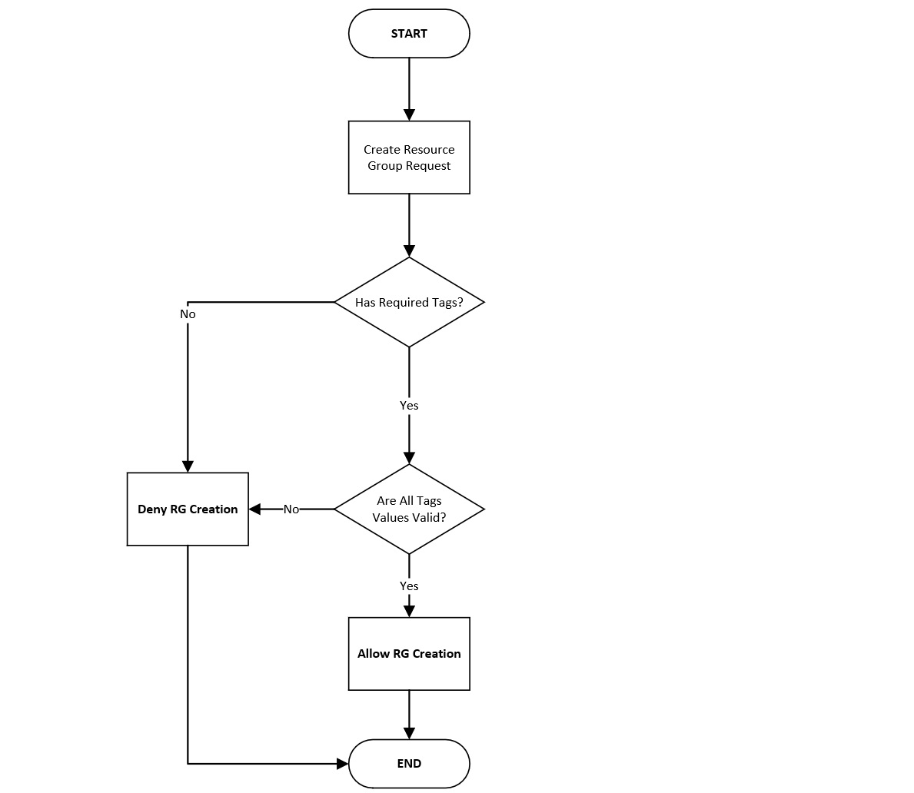

# Security and Compliance as a Code: Azure Policy TDD

| Tag Name | Required? | Description | Example Value |
| - | - | - | - |
| Owner     | Yes | Owner's email address | kamil@automate.guru artur@automationgurus.github.io |
| Environment | Yes | Can be only dev or prod | dev, prod |
| BusinessUnit | Yes | Division/Area/Team, all parts must be filled n  | itdivision/appsarea/csharpteam |
| EndDate  | No | Decommissioning date (DDMMYYYY) | 29022024  |
| ItsmRequestId | No | Service Request's ID | sr0001, sr1990 |

