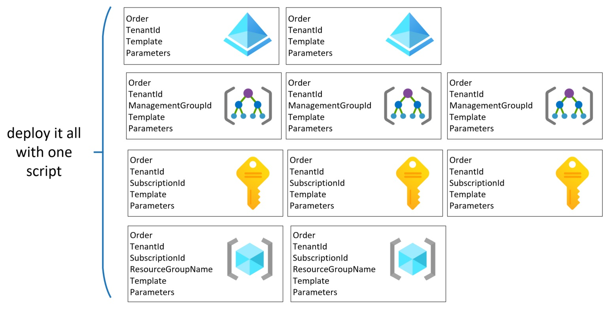
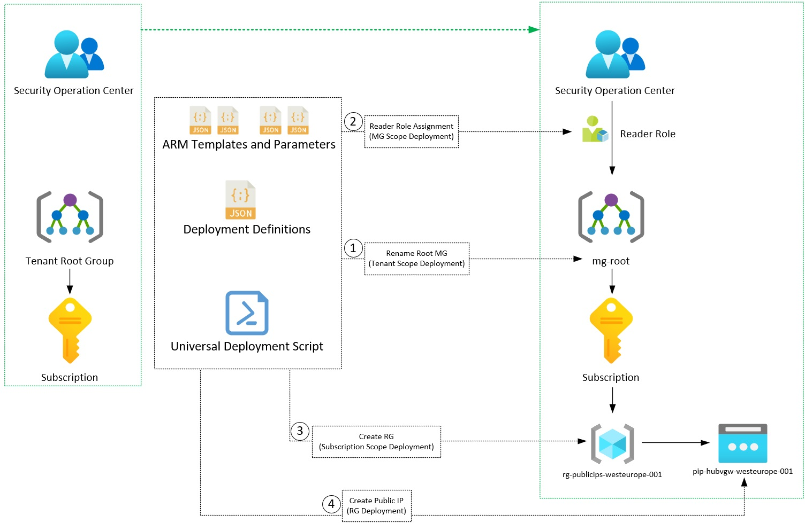
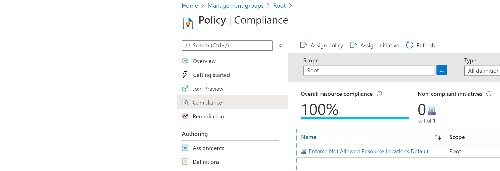
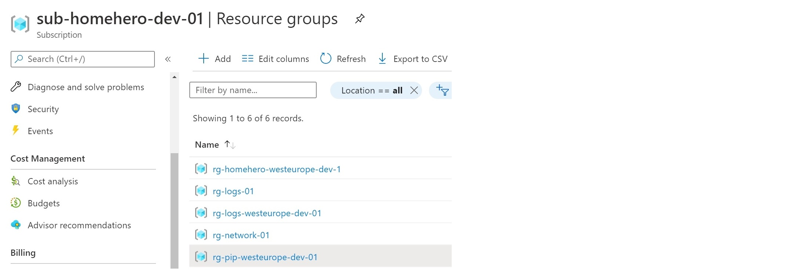
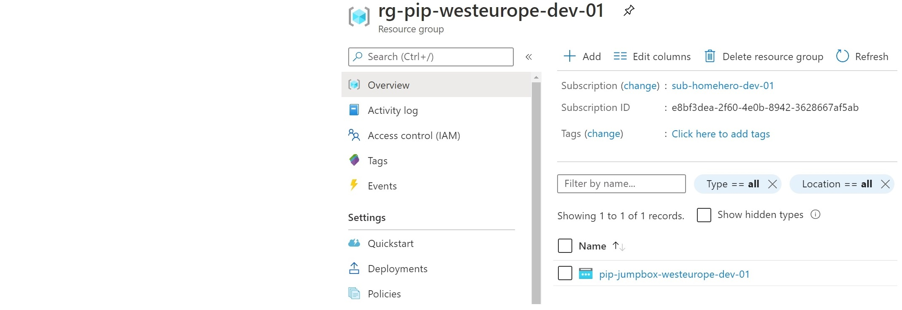

# Universal, multi-scope ARM Template Deployment Script



!!! question "Do you agree that..."
    ... we end up having **different deployment experience when testing and deploying to production**? 
    
    Our universal deployment script fixes this inconvenience.


## What are the requirements?

- Have one **consistent way of deploying** ARM templates in any scenario: from the local computer, or any CI/CD toolkit. The ability to execute a PowerShell script is the only required

- It will **not be required to modify the pipeline** when a new deployment is added. We need only one step that can deploy entire infrastructure, at any scope: Tenant, Management Group, Subscription, and Resource Group.

- **Use new deployment features immediately**. At the moment of writing deployment task in Azure DevOps does not support tenant deployment. 

- It is also not possible to use the new 'What-If' feature. We don't want to wait for them to be available.


## There are already many ways to deploy templates.

- Azure Portal
- Powershell
- Azure CLI
- Rest API
- Pipeline deployment task

## What can be deployed at higher than RG scope?

Scope             | Deployable types
:---------------- |:-------------
Tenant            | managementGroups, policyAssignments, policyDefinitions, policySetDefinitions, roleAssignments, roleDefinitions      
Management Group  | policyAssignments, policyDefinitions, policySetDefinitions, roleAssignments, roleDefinitions    
Subscription      | blueprints, budgets, eventSubscriptions, peerAsns, policyAssignments, policyDefinitions, policySetDefinitions, remediations, resourceGroups, roleAssignments, roleDefinitions, scopeAssignments, supportPlanTypes, tags, workspacesettings    

## Does this process sound familiar to you?

1. some resources must be created

2. templates development and parameters defining

3. deploying them from the command line to our test subscription (for example, MSDN one) - it is quicker to use some custom scripts deploy  

4. pull request creation and after some additional checks changes are merged to the master branch

5. automatic deployment starts, but it deploys infrastructure in a different way that was checked locally 


# How is it done - the universal deployment flow.

1. You define the deployment in the JSON file.

2. Provide required parameters appropriate to the scope of a particular deployment. 

    !!! done
        - You can deploy a resource group at the subscription level and then create resources in this RG. 
        - It is possible to create a management group and then define and assign policies there.

3. Order deployments according to your requirements. 

4. Execute from any place you want: laptop, pipeline agent, or Azure cloud shell.

5. You can use 'What-If' deployment if you're going to check what will be added, changed, modified, and deleted. At MG scope and Tenant scope, this feature is not available yet.

6. Resources are deployed one by one at the defined scope.

7. When it is required, then proper context is set before deployment.

8. Script will stop when an error occurs.

# Let's use universal ARM Deployment script

## What will be deployed?




## Where can you find the script and ARMs?

[Check our DevSecOps GitHub Repo](https://github.com/kwiecek/azure-devsecops/)

## Deployment definition file.

```
[
    {
        "Order": 0,
        "TemplateFile": "arm-templates\\ManagementGroups\\ManagementGroup.json",
        "TemplateParameterFile": "arm-templates\\ManagementGroups\\ManagementGroup.Root.Parameters.json",
        "TenantId": "{Replace-With-Tenant-Id}"
    },
    {
        "Order": 10,
        "TemplateFile": "arm-templates\\PolicySetAssignment\\AllowedLocationsAssignment.json",
        "TemplateParameterFile": "arm-templates\\PolicySetAssignment\\AllowedLocationsAssignment.Enforce.Parameters.Local.json",
        "TenantId": "{Replace-With-Tenant-Id}",
        "ManagementGroupId": "{Replace-With-Tenant-Id}"
    },
    {
        "Order": 20,
        "TemplateFile": "arm-templates\\ResourceGroups\\ResourceGroups.json",
        "TemplateParameterFile": "arm-templates\\ResourceGroups\\ResourceGroups.Parameters.json",
        "TenantId": "{Replace-With-Tenant-Id}",
        "SubscriptionId": "{Replace-With-Sub-Id}"
    },
    {
        "Order": 30,
        "TemplateFile": "arm-templates\\PublicIp\\PublicIp.json",
        "TemplateParameterFile": "arm-templates\\PublicIp\\PublicIp.Parameters.json",
        "TenantId": "{Replace-With-Tenant-Id}",
        "SubscriptionId": "{Replace-With-Sub-Id}",
        "RgName": "rg-pip-westeurope-dev-01",
        "Mode": "Incremental"
    }
]
```
## Deployment

``` powershell
git clone https://github.com/kwiecek/azure-devsecops.git
cd azure-devsecops
.\scripts\Deploy-ArmTemplate.ps1 -DeploymentDefinitionPath .\deployment-definitions\AllScopesExample.json
```

## Output

### Renamed Tenant Root Management Group and assigned Azure Policy



### Deployed Resource Groups



### Deployed Public IP




<!-- ## How it is done -->

## Author


**Kamil Więcek** is twentynine years old IT passionate that will continue to learn, do home projects and practicing new technologies even if he becomes a multimillionaire. 
Big fan of the following sentence: "if you describe a process mentioning someone's name, then it is not automated."
